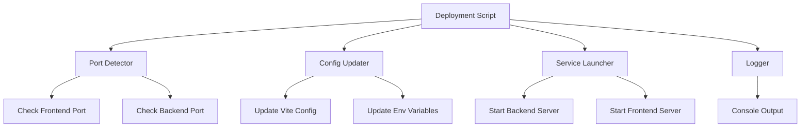
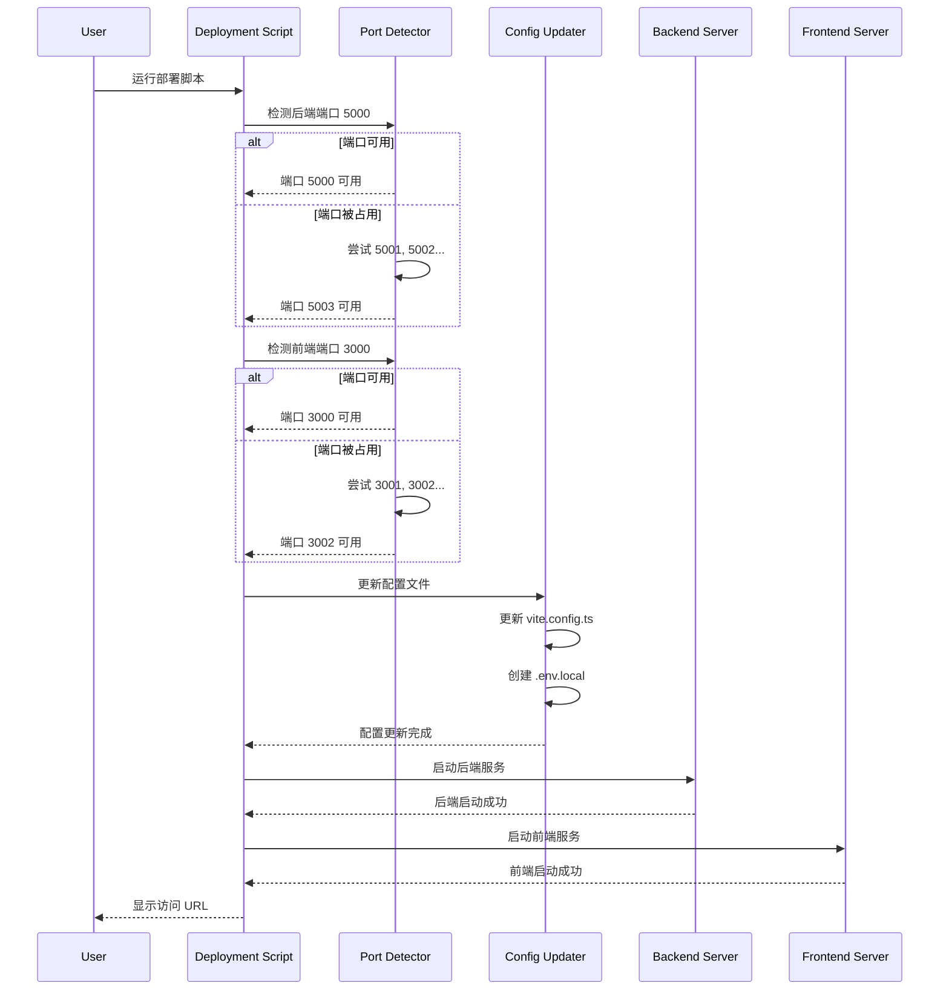

# 设计文档

## 概述

本设计实现了一个智能部署脚本系统，用于自动检测端口冲突并动态分配可用端口。系统由端口检测、配置更新、服务启动和日志输出四个核心模块组成，确保 OMS 项目的前后端服务能够在任何环境下顺利启动。

## 架构

### 系统架构图



### 执行流程



## 组件和接口

### 1. Port Detector（端口检测器）

**职责：** 检测指定端口是否被占用，并在端口被占用时寻找可用的替代端口。

**接口：**

```typescript
interface PortDetector {
  // 检查单个端口是否可用
  isPortAvailable(port: number): Promise<boolean>
  
  // 从起始端口开始查找可用端口
  findAvailablePort(startPort: number, maxAttempts: number): Promise<number>
  
  // 批量检查多个端口
  checkPorts(ports: number[]): Promise<Map<number, boolean>>
}
```

**实现细节：**

- 使用 Node.js 的 `net` 模块创建临时服务器来测试端口
- 如果端口可用，服务器能够成功监听并立即关闭
- 如果端口被占用，会抛出 EADDRINUSE 错误
- 端口搜索范围限制为起始端口 + 100

### 2. Config Updater（配置更新器）

**职责：** 动态更新前后端配置文件中的端口信息。

**接口：**

```typescript
interface ConfigUpdater {
  // 更新 Vite 配置文件
  updateViteConfig(frontendPort: number, backendPort: number): Promise<void>
  
  // 创建或更新环境变量文件
  updateEnvFile(backendPort: number): Promise<void>
  
  // 备份原始配置
  backupConfig(filePath: string): Promise<void>
  
  // 恢复配置
  restoreConfig(filePath: string): Promise<void>
}
```

**实现细节：**

- 使用文件系统操作读取和写入配置文件
- 对于 `vite.config.ts`，使用字符串替换更新端口号
- 创建 `.env.local` 文件设置 `PORT` 环境变量
- 在更新前备份原始配置，失败时可以回滚

### 3. Service Launcher（服务启动器）

**职责：** 使用分配的端口启动前后端服务，并监控服务状态。

**接口：**

```typescript
interface ServiceLauncher {
  // 启动后端服务
  startBackend(port: number): Promise<ChildProcess>
  
  // 启动前端服务
  startFrontend(port: number): Promise<ChildProcess>
  
  // 等待服务就绪
  waitForService(port: number, timeout: number): Promise<boolean>
  
  // 停止服务
  stopService(process: ChildProcess): Promise<void>
  
  // 停止所有服务
  stopAllServices(): Promise<void>
}
```

**实现细节：**

- 使用 `child_process.spawn` 启动服务
- 捕获子进程的 stdout 和 stderr 输出
- 通过 HTTP 请求验证服务是否就绪
- 实现优雅关闭，捕获 SIGINT 和 SIGTERM 信号

### 4. Logger（日志记录器）

**职责：** 提供格式化的日志输出，区分不同级别的信息。

**接口：**

```typescript
interface Logger {
  // 信息日志
  info(message: string): void
  
  // 成功日志
  success(message: string): void
  
  // 警告日志
  warn(message: string): void
  
  // 错误日志
  error(message: string, error?: Error): void
  
  // 调试日志
  debug(message: string): void
}
```

**实现细节：**

- 使用 ANSI 颜色代码为不同级别的日志添加颜色
- 添加时间戳和日志级别标识
- 支持结构化日志输出

### 5. Deployment Script（部署脚本）

**职责：** 协调所有组件，执行完整的部署流程。

**主要流程：**

```typescript
async function deploy() {
  // 1. 读取环境变量或使用默认端口
  const defaultBackendPort = process.env.BACKEND_PORT || 5000
  const defaultFrontendPort = process.env.FRONTEND_PORT || 3000
  
  // 2. 检测并分配后端端口
  const backendPort = await portDetector.findAvailablePort(defaultBackendPort, 100)
  
  // 3. 检测并分配前端端口
  const frontendPort = await portDetector.findAvailablePort(defaultFrontendPort, 100)
  
  // 4. 更新配置文件
  await configUpdater.updateViteConfig(frontendPort, backendPort)
  await configUpdater.updateEnvFile(backendPort)
  
  // 5. 启动后端服务
  const backendProcess = await serviceLauncher.startBackend(backendPort)
  await serviceLauncher.waitForService(backendPort, 30000)
  
  // 6. 启动前端服务
  const frontendProcess = await serviceLauncher.startFrontend(frontendPort)
  await serviceLauncher.waitForService(frontendPort, 30000)
  
  // 7. 输出访问信息
  logger.success(`Frontend: http://localhost:${frontendPort}`)
  logger.success(`Backend: http://localhost:${backendPort}`)
  
  // 8. 设置优雅关闭
  setupGracefulShutdown([backendProcess, frontendProcess])
}
```

## 数据模型

### DeploymentConfig

```typescript
interface DeploymentConfig {
  // 前端配置
  frontend: {
    defaultPort: number
    actualPort: number
    configPath: string
  }
  
  // 后端配置
  backend: {
    defaultPort: number
    actualPort: number
    envPath: string
  }
  
  // 端口搜索配置
  portSearch: {
    maxAttempts: number
    timeout: number
  }
  
  // 服务启动配置
  services: {
    startupTimeout: number
    healthCheckInterval: number
  }
}
```

### PortCheckResult

```typescript
interface PortCheckResult {
  port: number
  available: boolean
  error?: string
}
```

### ServiceStatus

```typescript
interface ServiceStatus {
  name: string
  port: number
  process: ChildProcess | null
  status: 'starting' | 'running' | 'stopped' | 'error'
  startTime?: Date
  error?: Error
}
```

## 正确性属性

*属性是一种特征或行为，应该在系统的所有有效执行中保持为真——本质上是关于系统应该做什么的形式化陈述。属性作为人类可读规范和机器可验证正确性保证之间的桥梁。*


### 属性 1：端口检测返回正确状态

*对于任意* 端口号，当调用端口检测函数时，返回值应该是布尔类型，且准确反映该端口的实际可用状态（可用返回 true，被占用返回 false）

**验证需求：1.1**

### 属性 2：批量端口检测完整性

*对于任意* 端口号列表，批量检测函数应该返回包含所有输入端口状态的结果集，且结果集的大小等于输入列表的大小

**验证需求：1.3**

### 属性 3：端口搜索递增顺序

*对于任意* 起始端口号，当该端口被占用时，端口搜索应该按照递增顺序（startPort + 1, startPort + 2, ...）依次尝试，直到找到可用端口或达到搜索限制

**验证需求：2.1**

### 属性 4：端口搜索范围限制

*对于任意* 起始端口号和最大尝试次数，端口搜索返回的端口号应该在 [startPort, startPort + maxAttempts) 范围内，或者在范围内无可用端口时抛出错误

**验证需求：2.2, 2.3**

### 属性 5：前后端端口独立分配

*对于任意* 部署场景，前端和后端的端口分配应该是独立的，一个服务的端口选择不应影响另一个服务的端口搜索起点

**验证需求：2.5**

### 属性 6：配置更新往返一致性

*对于任意* 有效的端口号，更新配置文件后读取配置，应该能够获取到相同的端口值（往返属性）

**验证需求：3.1, 3.2**

### 属性 7：配置更新不变性

*对于任意* 配置文件，更新端口信息后，配置文件中除端口相关字段外的其他字段应该保持不变

**验证需求：3.3**

### 属性 8：服务启动端口一致性

*对于任意* 分配的端口号，启动的服务进程应该监听在该端口上，且健康检查能够在该端口上成功连接

**验证需求：4.1, 4.5**

### 属性 9：端口占用日志记录

*对于任意* 被占用的端口，系统日志应该包含该端口被占用的信息以及正在尝试的新端口号

**验证需求：1.2, 5.2**

### 属性 10：成功部署日志完整性

*对于任意* 成功的部署，系统日志应该包含最终使用的前端端口、后端端口以及完整的访问 URL

**验证需求：5.3, 5.4**

### 属性 11：日志级别区分

*对于任意* 日志输出，不同级别（info、warn、error）的日志应该有不同的视觉标记或颜色代码

**验证需求：5.6**

### 属性 12：错误日志信息性

*对于任意* 错误场景，错误日志应该包含清晰的错误描述和可能的解决方案建议

**验证需求：5.5**

### 属性 13：环境变量端口覆盖

*对于任意* 有效的环境变量端口值（FRONTEND_PORT 或 BACKEND_PORT），系统应该使用该值作为相应服务的默认端口，而不是硬编码的默认值

**验证需求：7.1, 7.2**

### 属性 14：环境变量端口搜索起点

*对于任意* 通过环境变量指定的端口，如果该端口被占用，端口搜索应该从该端口开始递增，而不是从硬编码的默认端口开始

**验证需求：7.3**

### 属性 15：环境变量使用日志

*对于任意* 部署场景，如果使用了环境变量配置端口，系统日志应该明确指出使用了环境变量及其值

**验证需求：7.4**

### 属性 16：信号捕获和优雅关闭

*对于任意* 运行中的部署，当接收到中断信号（SIGINT 或 SIGTERM）时，系统应该捕获信号并依次停止前端和后端服务

**验证需求：8.1, 8.2, 8.3**

### 属性 17：端口释放

*对于任意* 停止的服务，其占用的端口应该被释放，使得该端口在服务停止后立即可用

**验证需求：8.4**

### 属性 18：关闭确认日志

*对于任意* 完成的关闭流程，系统日志应该包含关闭完成的确认信息

**验证需求：8.5**

## 错误处理

### 端口检测错误

- **场景：** 网络错误导致端口检测失败
- **处理：** 返回明确的错误信息，包含错误类型和端口号
- **恢复：** 允许重试或跳过该端口继续搜索

### 端口耗尽错误

- **场景：** 在搜索范围内未找到可用端口
- **处理：** 抛出错误，停止部署流程
- **日志：** 输出已尝试的端口范围和建议（如增加搜索范围或手动释放端口）

### 配置更新错误

- **场景：** 配置文件写入失败（权限问题、磁盘空间不足等）
- **处理：** 回滚到备份的原始配置
- **日志：** 输出详细的错误信息和文件路径

### 服务启动错误

- **场景：** 服务进程启动失败或启动超时
- **处理：** 停止已启动的服务，清理资源
- **日志：** 输出服务名称、端口号和错误详情

### 环境变量无效错误

- **场景：** 环境变量值非数字或超出有效端口范围（1-65535）
- **处理：** 使用默认端口值
- **日志：** 输出警告信息，说明使用了默认值

### 健康检查超时

- **场景：** 服务启动后在指定时间内未响应健康检查
- **处理：** 停止服务，报告启动失败
- **日志：** 输出超时信息和已等待的时间

## 测试策略

### 双重测试方法

本项目采用单元测试和基于属性的测试相结合的方法，以确保全面覆盖：

- **单元测试：** 验证特定示例、边缘情况和错误条件
- **属性测试：** 验证跨所有输入的通用属性

两者是互补的，共同提供全面的覆盖（单元测试捕获具体错误，属性测试验证通用正确性）。

### 单元测试重点

单元测试应该专注于：
- 特定示例，展示正确行为
- 组件之间的集成点
- 边缘情况和错误条件

避免编写过多的单元测试 - 基于属性的测试会处理大量输入的覆盖。

### 基于属性的测试

**测试库：** 使用 `fast-check` 库进行 TypeScript/JavaScript 的基于属性的测试

**配置：**
- 每个属性测试最少运行 100 次迭代（由于随机化）
- 每个测试必须引用其设计文档属性
- 标签格式：**Feature: auto-port-deployment, Property {number}: {property_text}**

**测试覆盖：**

1. **端口检测属性测试**
   - 属性 1：端口检测返回正确状态
   - 属性 2：批量端口检测完整性
   - 生成随机端口号和端口列表

2. **端口搜索属性测试**
   - 属性 3：端口搜索递增顺序
   - 属性 4：端口搜索范围限制
   - 属性 5：前后端端口独立分配
   - 生成随机起始端口和搜索限制

3. **配置更新属性测试**
   - 属性 6：配置更新往返一致性
   - 属性 7：配置更新不变性
   - 生成随机端口号和配置内容

4. **服务启动属性测试**
   - 属性 8：服务启动端口一致性
   - 生成随机端口号

5. **日志输出属性测试**
   - 属性 9：端口占用日志记录
   - 属性 10：成功部署日志完整性
   - 属性 11：日志级别区分
   - 属性 12：错误日志信息性
   - 生成随机端口和错误场景

6. **环境变量属性测试**
   - 属性 13：环境变量端口覆盖
   - 属性 14：环境变量端口搜索起点
   - 属性 15：环境变量使用日志
   - 生成随机环境变量值

7. **优雅关闭属性测试**
   - 属性 16：信号捕获和优雅关闭
   - 属性 17：端口释放
   - 属性 18：关闭确认日志
   - 模拟信号发送和服务停止

### 边缘情况单元测试

以下边缘情况应该通过单元测试覆盖：

1. **端口检测失败**（需求 1.4）
   - 模拟网络错误
   - 验证错误信息清晰

2. **端口耗尽**（需求 2.4）
   - 占用所有搜索范围内的端口
   - 验证系统正确报错

3. **配置更新失败和回滚**（需求 3.4）
   - 模拟文件写入失败
   - 验证配置被正确恢复

4. **服务启动失败**（需求 4.3）
   - 模拟服务启动错误
   - 验证部署流程正确停止

5. **无效环境变量**（需求 7.5）
   - 设置非数字或超出范围的环境变量
   - 验证系统回退到默认值并输出警告

### 示例测试

以下场景应该通过示例测试覆盖：

1. **配置更新顺序**（需求 3.5）
   - 验证配置更新在服务启动前完成

2. **服务启动顺序**（需求 4.2, 4.4）
   - 验证后端先启动，前端后启动

3. **部署开始日志**（需求 5.1）
   - 验证部署开始时输出默认端口信息

4. **关闭顺序**（需求 8.2, 8.3）
   - 验证前端先停止，后端后停止

### 集成测试

虽然不是本设计的重点，但建议进行以下集成测试：

1. **端到端部署流程**
   - 从脚本启动到服务就绪的完整流程
   - 验证前端能够通过代理访问后端

2. **实际端口冲突场景**
   - 在实际环境中占用默认端口
   - 验证系统能够找到替代端口并成功部署

3. **跨平台测试**
   - 在 Windows、macOS 和 Linux 上运行部署脚本
   - 验证所有功能正常工作
