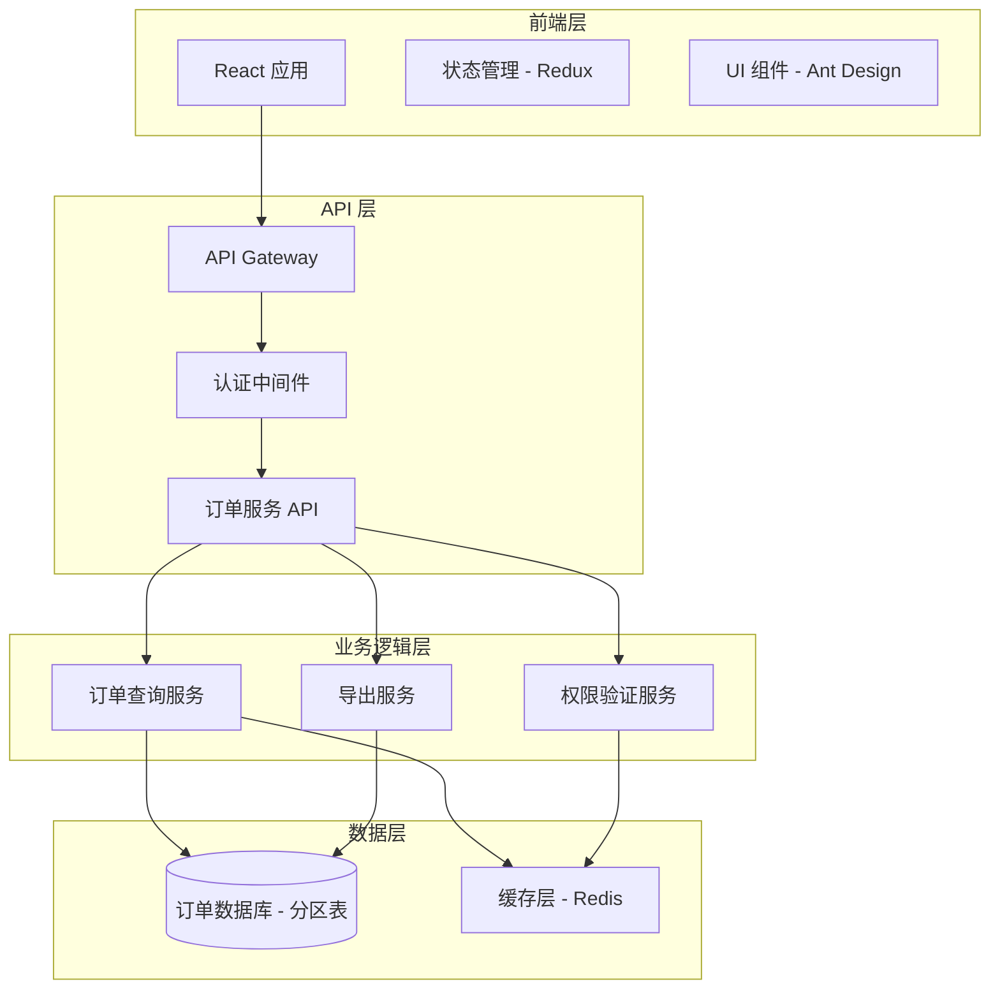

# 设计文档 - OMS 小包裹管理页面

## 概述

本设计文档描述了 OMS 小包裹管理页面的技术实现方案。系统采用前后端分离架构，前端使用 React + TypeScript + Ant Design 构建响应式用户界面，后端使用 RESTful API 提供数据服务。核心设计重点包括：

1. **数据库分区策略**: 通过 archive_flag 和 create_time 分区优化大数据量查询性能
2. **权限控制**: 基于角色的访问控制（RBAC）限制归档订单查看权限
3. **性能优化**: 异步加载、分页查询、导出限流等机制保证用户体验
4. **响应式设计**: 适配桌面和移动设备的灵活布局

## 架构

### 系统架构图



### 技术栈

**前端**:
- React 18.x + TypeScript 5.x
- Ant Design 5.x (UI 组件库)
- Redux Toolkit (状态管理)
- React Query (数据获取和缓存)
- Axios (HTTP 客户端)

**后端**:
- Node.js + Express / Spring Boot (根据现有技术栈选择)
- JWT (身份认证)
- PostgreSQL / MySQL (数据库，支持表分区)

**部署**:
- Docker 容器化
- Nginx 反向代理

## 组件和接口

### 前端组件结构

```
src/
├── pages/
│   └── SmallParcel/
│       ├── index.tsx                 # 主页面组件
│       ├── components/
│       │   ├── OrderTable.tsx        # 订单表格组件
│       │   ├── FilterBar.tsx         # 过滤器栏组件
│       │   ├── SearchBar.tsx         # 搜索栏组件
│       │   ├── ColumnSettings.tsx    # 列设置组件
│       │   ├── ExportDialog.tsx      # 导出对话框组件
│       │   └── AdvancedSearch.tsx    # 高级搜索组件
│       ├── hooks/
│       │   ├── useOrders.ts          # 订单数据钩子
│       │   ├── useFilters.ts         # 过滤器钩子
│       │   └── usePermissions.ts     # 权限钩子
│       └── types.ts                  # 类型定义
├── services/
│   ├── orderService.ts               # 订单 API 服务
│   └── authService.ts                # 认证服务
└── store/
    └── orderSlice.ts                 # 订单状态切片
```

### 核心组件设计

#### 1. SmallParcel 主页面组件

```typescript
interface SmallParcelPageProps {}

interface SmallParcelPageState {
  orders: Order[];
  loading: boolean;
  pagination: PaginationConfig;
  filters: FilterConfig;
  includeArchived: boolean;
  selectedColumns: string[];
}

// 主页面组件负责：
// - 协调子组件交互
// - 管理全局状态
// - 处理权限检查
// - 触发数据加载
```

#### 2. OrderTable 订单表格组件

```typescript
interface OrderTableProps {
  orders: Order[];
  loading: boolean;
  pagination: PaginationConfig;
  selectedColumns: string[];
  onPaginationChange: (page: number, pageSize: number) => void;
}

// 表格组件负责：
// - 渲染订单数据
// - 处理分页交互
// - 支持列的显示/隐藏
// - 提供排序功能
```

#### 3. FilterBar 过滤器栏组件

```typescript
interface FilterBarProps {
  activeFilters: Filter[];
  includeArchived: boolean;
  showArchivedCheckbox: boolean;
  onIncludeArchivedChange: (checked: boolean) => void;
  onClearAll: () => void;
  onRemoveFilter: (filterId: string) => void;
}

// 过滤器栏负责：
// - 显示激活的过滤器标签
// - 管理"Include Archived Orders"复选框
// - 提供清除过滤器功能
```

### API 接口设计

#### 1. 查询订单列表

```
GET /api/orders/small-parcel

Query Parameters:
- page: number (页码，默认 1)
- pageSize: number (每页记录数，默认 20)
- includeArchived: boolean (是否包含归档订单，默认 false)
- search: string (搜索关键词，可选)
- filters: string (JSON 格式的过滤条件，可选)
- sortBy: string (排序字段，可选)
- sortOrder: 'asc' | 'desc' (排序方向，可选)

Response:
{
  "success": true,
  "data": {
    "orders": [
      {
        "airbillNo": "string",
        "customerName": "string",
        "billingRef": "string",
        "status": "string",
        "serviceType": "string",
        "serviceCenter": "string",
        "fromCity": "string",
        "toCity": "string",
        "toAttn": "string",
        "toZip": "string",
        "createTime": "ISO8601 datetime",
        "lastOperationTime": "ISO8601 datetime",
        "archiveFlag": 0 | 1
      }
    ],
    "total": number,
    "page": number,
    "pageSize": number
  }
}
```

#### 2. 导出订单数据

```
POST /api/orders/small-parcel/export

Request Body:
{
  "includeArchived": boolean,
  "filters": object,
  "search": string,
  "format": "csv" | "excel"
}

Response:
{
  "success": true,
  "data": {
    "taskId": "string",
    "estimatedRows": number,
    "requiresConfirmation": boolean
  }
}

如果 estimatedRows > 50000，前端需要二次确认
```

#### 3. 确认导出任务

```
POST /api/orders/small-parcel/export/confirm

Request Body:
{
  "taskId": "string"
}

Response:
{
  "success": true,
  "data": {
    "downloadUrl": "string",
    "expiresAt": "ISO8601 datetime"
  }
}
```

#### 4. 获取用户权限

```
GET /api/auth/permissions

Response:
{
  "success": true,
  "data": {
    "role": "string",
    "permissions": ["string"],
    "canViewArchivedOrders": boolean
  }
}
```

## 数据模型

### 订单表结构

```sql
CREATE TABLE orders (
    id BIGINT PRIMARY KEY,
    airbill_no VARCHAR(50) NOT NULL UNIQUE,
    customer_name VARCHAR(200) NOT NULL,
    billing_ref VARCHAR(100),
    status VARCHAR(50) NOT NULL,
    service_type VARCHAR(100),
    service_center VARCHAR(100),
    from_city VARCHAR(100),
    to_city VARCHAR(100),
    to_attn VARCHAR(200),
    to_zip VARCHAR(20),
    create_time TIMESTAMP NOT NULL,
    last_operation_time TIMESTAMP,
    archive_flag SMALLINT NOT NULL DEFAULT 0,
    created_at TIMESTAMP DEFAULT CURRENT_TIMESTAMP,
    updated_at TIMESTAMP DEFAULT CURRENT_TIMESTAMP,
    INDEX idx_airbill_no (airbill_no),
    INDEX idx_customer_name (customer_name),
    INDEX idx_status (status),
    INDEX idx_create_time (create_time)
) PARTITION BY LIST (archive_flag);

-- 活跃订单分区（archive_flag = 0）
CREATE TABLE orders_active PARTITION OF orders
    FOR VALUES IN (0)
    PARTITION BY RANGE (create_time);

-- 按月创建活跃订单子分区
CREATE TABLE orders_active_2024_01 PARTITION OF orders_active
    FOR VALUES FROM ('2024-01-01') TO ('2024-02-01');

CREATE TABLE orders_active_2024_02 PARTITION OF orders_active
    FOR VALUES FROM ('2024-02-01') TO ('2024-03-01');

-- 归档订单分区（archive_flag = 1）
CREATE TABLE orders_archived PARTITION OF orders
    FOR VALUES IN (1)
    PARTITION BY RANGE (create_time);

-- 按年创建归档订单子分区
CREATE TABLE orders_archived_2023 PARTITION OF orders_archived
    FOR VALUES FROM ('2023-01-01') TO ('2024-01-01');

CREATE TABLE orders_archived_2022 PARTITION OF orders_archived
    FOR VALUES FROM ('2022-01-01') TO ('2023-01-01');
```

### TypeScript 类型定义

```typescript
// 订单类型
interface Order {
  id: number;
  airbillNo: string;
  customerName: string;
  billingRef: string;
  status: OrderStatus;
  serviceType: string;
  serviceCenter: string;
  fromCity: string;
  toCity: string;
  toAttn: string;
  toZip: string;
  createTime: string;
  lastOperationTime: string;
  archiveFlag: 0 | 1;
}

// 订单状态枚举
enum OrderStatus {
  PENDING = 'Pending',
  IN_TRANSIT = 'In Transit',
  DELIVERED = 'Delivered',
  CANCELLED = 'Cancelled',
  RETURNED = 'Returned'
}

// 过滤器配置
interface FilterConfig {
  status?: OrderStatus[];
  serviceType?: string[];
  serviceCenter?: string[];
  dateRange?: {
    start: string;
    end: string;
  };
}

// 分页配置
interface PaginationConfig {
  page: number;
  pageSize: number;
  total: number;
}

// 用户权限
interface UserPermissions {
  role: string;
  canViewArchivedOrders: boolean;
  canExportData: boolean;
}

// 导出任务
interface ExportTask {
  taskId: string;
  estimatedRows: number;
  requiresConfirmation: boolean;
  status: 'pending' | 'processing' | 'completed' | 'failed';
  downloadUrl?: string;
}
```

### 查询优化策略

#### 1. 分区裁剪

```sql
-- 仅查询活跃订单（自动裁剪到 orders_active 分区）
SELECT * FROM orders 
WHERE archive_flag = 0 
  AND create_time >= '2024-01-01'
ORDER BY create_time DESC
LIMIT 20;

-- 查询包含归档订单（扫描所有分区）
SELECT * FROM orders 
WHERE create_time >= '2023-01-01'
ORDER BY create_time DESC
LIMIT 20;
```

#### 2. 索引策略

- `airbill_no`: 唯一索引，支持精确查找
- `customer_name`: B-tree 索引，支持模糊搜索
- `status`: B-tree 索引，支持状态过滤
- `create_time`: B-tree 索引，支持时间范围查询和排序
- 复合索引 `(archive_flag, create_time)`: 优化归档标志 + 时间范围查询

#### 3. 缓存策略

- 使用 Redis 缓存用户权限信息（TTL: 30 分钟）
- 缓存常用过滤器的查询结果（TTL: 5 分钟）
- 缓存订单状态枚举等静态数据（TTL: 24 小时）


## 正确性属性

*属性是一个特征或行为，应该在系统的所有有效执行中保持为真——本质上是关于系统应该做什么的形式化陈述。属性作为人类可读规范和机器可验证正确性保证之间的桥梁。*

### 属性 1: 默认查询活跃订单

*对于任何*初始页面加载，系统应该只查询和显示 archive_flag=0 的订单。

**验证: 需求 2.2**

### 属性 2: 归档订单查询一致性

*对于任何*查询请求，当 includeArchived=false 时，返回的所有订单的 archive_flag 应该为 0；当 includeArchived=true 时，返回的订单可以包含任何 archive_flag 值。

**验证: 需求 3.2, 3.3, 4.2, 4.3**

### 属性 3: 权限控制复选框可见性

*对于任何*用户会话，"Include Archived Orders" 复选框的可见性应该等于用户角色是否为 Operations_Manager。

**验证: 需求 3.4, 3.5**

### 属性 4: 过滤器标签显示一致性

*对于任何*激活的过滤器集合，过滤器区域显示的标签应该与当前激活的过滤器一一对应。

**验证: 需求 5.1, 5.2**

### 属性 5: 清除过滤器操作

*对于任何*包含过滤器的状态，执行清除操作后，所有过滤器应该被移除，且订单列表应该刷新为无过滤状态。

**验证: 需求 5.4**

### 属性 6: 搜索结果匹配性

*对于任何*搜索关键词，返回的所有订单应该在 airbillNo、customerName 或 billingRef 字段中至少包含该关键词的一个匹配。

**验证: 需求 6.2**

### 属性 7: 列可见性控制

*对于任何*列选择配置，表格中显示的列应该精确匹配被选中的列集合。

**验证: 需求 7.3**

### 属性 8: 列配置持久化（往返属性）

*对于任何*列配置，保存后刷新页面，加载的列配置应该与保存前的配置相同。

**验证: 需求 7.4**

### 属性 9: 导出数据一致性

*对于任何*当前的过滤和搜索条件，导出的订单数据应该与当前查询结果完全匹配。

**验证: 需求 8.2**

### 属性 10: 加载状态指示器一致性

*对于任何*查询操作，加载指示器应该在查询开始时显示，在查询完成时隐藏。

**验证: 需求 9.1, 9.5**

### 属性 11: 权限查询限制

*对于任何*非 Operations_Manager 用户的查询请求，系统应该自动将 includeArchived 设置为 false，忽略客户端传递的值。

**验证: 需求 10.2, 10.3**

### 属性 12: 未授权访问错误提示

*对于任何*未授权的功能访问尝试，系统应该返回权限错误并在 UI 上显示错误提示。

**验证: 需求 10.4**

### 属性 13: 响应式布局调整

*对于任何*屏幕宽度变化，当宽度小于 1280px 时，表格布局应该调整为适应小屏幕的模式（横向滚动或卡片式布局）。

**验证: 需求 11.2**

## 错误处理

### 前端错误处理

#### 1. 网络错误

```typescript
// 使用 Axios 拦截器统一处理网络错误
axios.interceptors.response.use(
  response => response,
  error => {
    if (error.code === 'ECONNABORTED') {
      message.error('请求超时，请检查网络连接');
    } else if (error.response?.status === 500) {
      message.error('服务器错误，请稍后重试');
    } else if (error.response?.status === 403) {
      message.error('权限不足，无法访问该功能');
    } else {
      message.error('请求失败，请稍后重试');
    }
    return Promise.reject(error);
  }
);
```

#### 2. 数据验证错误

```typescript
// 在组件中验证数据完整性
const validateOrderData = (order: Order): boolean => {
  if (!order.airbillNo || !order.customerName) {
    console.error('订单数据不完整', order);
    return false;
  }
  return true;
};

// 过滤无效数据
const validOrders = orders.filter(validateOrderData);
```

#### 3. 权限错误

```typescript
// 权限检查钩子
const usePermissionCheck = () => {
  const { permissions } = useAuth();
  
  const checkPermission = (requiredPermission: string): boolean => {
    if (!permissions.includes(requiredPermission)) {
      message.warning('您没有权限执行此操作');
      return false;
    }
    return true;
  };
  
  return { checkPermission };
};
```

### 后端错误处理

#### 1. 数据库查询错误

```typescript
// 使用 try-catch 包装数据库操作
async function getOrders(params: QueryParams): Promise<OrderResponse> {
  try {
    const result = await db.query(buildQuery(params));
    return {
      success: true,
      data: result
    };
  } catch (error) {
    logger.error('数据库查询失败', error);
    return {
      success: false,
      error: {
        code: 'DB_QUERY_ERROR',
        message: '查询订单失败，请稍后重试'
      }
    };
  }
}
```

#### 2. 权限验证错误

```typescript
// 权限验证中间件
const checkArchivedOrderPermission = (req, res, next) => {
  const { includeArchived } = req.query;
  const { role } = req.user;
  
  if (includeArchived === 'true' && role !== 'Operations_Manager') {
    return res.status(403).json({
      success: false,
      error: {
        code: 'PERMISSION_DENIED',
        message: '您没有权限查看归档订单'
      }
    });
  }
  
  next();
};
```

#### 3. 导出任务错误

```typescript
// 导出任务错误处理
async function createExportTask(params: ExportParams): Promise<ExportTaskResponse> {
  try {
    // 估算数据量
    const estimatedRows = await estimateRowCount(params);
    
    if (estimatedRows > 1000000) {
      return {
        success: false,
        error: {
          code: 'EXPORT_TOO_LARGE',
          message: '导出数据量超过限制（最大 100 万行）'
        }
      };
    }
    
    // 创建导出任务
    const task = await exportService.createTask(params);
    
    return {
      success: true,
      data: task
    };
  } catch (error) {
    logger.error('创建导出任务失败', error);
    return {
      success: false,
      error: {
        code: 'EXPORT_TASK_ERROR',
        message: '创建导出任务失败，请稍后重试'
      }
    };
  }
}
```

### 错误边界

```typescript
// React 错误边界组件
class ErrorBoundary extends React.Component<Props, State> {
  constructor(props: Props) {
    super(props);
    this.state = { hasError: false };
  }

  static getDerivedStateFromError(error: Error) {
    return { hasError: true };
  }

  componentDidCatch(error: Error, errorInfo: React.ErrorInfo) {
    logger.error('组件渲染错误', error, errorInfo);
  }

  render() {
    if (this.state.hasError) {
      return (
        <Result
          status="error"
          title="页面加载失败"
          subTitle="抱歉，页面遇到了问题，请刷新重试"
          extra={
            <Button type="primary" onClick={() => window.location.reload()}>
              刷新页面
            </Button>
          }
        />
      );
    }

    return this.props.children;
  }
}
```

## 测试策略

### 双重测试方法

本系统采用单元测试和基于属性的测试相结合的方法，以确保全面的代码覆盖和正确性验证：

- **单元测试**: 验证特定示例、边界情况和错误条件
- **基于属性的测试**: 验证跨所有输入的通用属性

两者是互补的，都是全面覆盖所必需的。单元测试捕获具体的错误，基于属性的测试验证一般正确性。

### 单元测试策略

**前端单元测试** (使用 Jest + React Testing Library):

1. **组件渲染测试**:
   - 验证页面标题、描述文本的正确显示
   - 验证按钮、输入框等 UI 元素的存在性
   - 验证表格列的正确渲染

2. **用户交互测试**:
   - 测试点击"Clear All"按钮清除过滤器
   - 测试点击"Advanced Search"按钮打开高级搜索
   - 测试点击列设置按钮显示列配置面板

3. **边界情况测试**:
   - 测试导出数据量超过 50,000 行时显示确认对话框
   - 测试查询时间超过 3 秒时显示提示信息
   - 测试空数据状态的显示

4. **错误条件测试**:
   - 测试网络请求失败时的错误提示
   - 测试权限不足时的错误提示
   - 测试数据验证失败时的处理

**后端单元测试** (使用 Jest / JUnit):

1. **API 端点测试**:
   - 测试订单查询 API 的正确响应
   - 测试导出 API 的任务创建
   - 测试权限验证 API 的响应

2. **业务逻辑测试**:
   - 测试过滤器逻辑的正确性
   - 测试搜索逻辑的匹配规则
   - 测试权限验证逻辑

3. **数据库操作测试**:
   - 测试分区查询的正确性
   - 测试索引使用的优化
   - 测试事务处理的正确性

### 基于属性的测试策略

**测试库选择**: 
- 前端: fast-check (JavaScript/TypeScript)
- 后端: fast-check (Node.js) / jqwik (Java)

**测试配置**:
- 每个属性测试最少运行 100 次迭代
- 每个测试必须引用其设计文档属性
- 标签格式: **Feature: oms-small-parcel, Property {number}: {property_text}**

**基于属性的测试用例**:

#### 1. 属性 2: 归档订单查询一致性

```typescript
// Feature: oms-small-parcel, Property 2: 归档订单查询一致性
describe('Property: Archive query consistency', () => {
  it('should return only active orders when includeArchived is false', async () => {
    await fc.assert(
      fc.asyncProperty(
        fc.record({
          page: fc.integer({ min: 1, max: 100 }),
          pageSize: fc.integer({ min: 10, max: 100 }),
          search: fc.option(fc.string(), { nil: undefined }),
          filters: fc.option(fc.object(), { nil: undefined })
        }),
        async (queryParams) => {
          const response = await orderService.getOrders({
            ...queryParams,
            includeArchived: false
          });
          
          // 所有返回的订单应该是活跃订单
          expect(response.data.orders.every(o => o.archiveFlag === 0)).toBe(true);
        }
      ),
      { numRuns: 100 }
    );
  });
  
  it('should return all orders when includeArchived is true', async () => {
    await fc.assert(
      fc.asyncProperty(
        fc.record({
          page: fc.integer({ min: 1, max: 100 }),
          pageSize: fc.integer({ min: 10, max: 100 })
        }),
        async (queryParams) => {
          const response = await orderService.getOrders({
            ...queryParams,
            includeArchived: true
          });
          
          // 返回的订单可以包含任何 archive_flag 值
          const hasActiveOrders = response.data.orders.some(o => o.archiveFlag === 0);
          const hasArchivedOrders = response.data.orders.some(o => o.archiveFlag === 1);
          
          // 至少应该有一种类型的订单（假设数据库中有数据）
          expect(hasActiveOrders || hasArchivedOrders).toBe(true);
        }
      ),
      { numRuns: 100 }
    );
  });
});
```

#### 2. 属性 6: 搜索结果匹配性

```typescript
// Feature: oms-small-parcel, Property 6: 搜索结果匹配性
describe('Property: Search result matching', () => {
  it('should return orders matching the search keyword', async () => {
    await fc.assert(
      fc.asyncProperty(
        fc.string({ minLength: 1, maxLength: 50 }),
        async (searchKeyword) => {
          const response = await orderService.getOrders({
            search: searchKeyword,
            page: 1,
            pageSize: 20
          });
          
          // 所有返回的订单应该在指定字段中包含搜索关键词
          expect(
            response.data.orders.every(order =>
              order.airbillNo.includes(searchKeyword) ||
              order.customerName.includes(searchKeyword) ||
              order.billingRef?.includes(searchKeyword)
            )
          ).toBe(true);
        }
      ),
      { numRuns: 100 }
    );
  });
});
```

#### 3. 属性 8: 列配置持久化

```typescript
// Feature: oms-small-parcel, Property 8: 列配置持久化
describe('Property: Column configuration persistence', () => {
  it('should persist and restore column configuration', async () => {
    await fc.assert(
      fc.asyncProperty(
        fc.array(
          fc.constantFrom(
            'airbillNo', 'customerName', 'billingRef', 'status',
            'serviceType', 'serviceCenter', 'fromCity', 'toCity',
            'toAttn', 'toZip', 'createTime', 'lastOperationTime'
          ),
          { minLength: 1, maxLength: 12 }
        ),
        async (selectedColumns) => {
          // 保存列配置
          await columnService.saveConfiguration(selectedColumns);
          
          // 模拟页面刷新，重新加载配置
          const loadedColumns = await columnService.loadConfiguration();
          
          // 加载的配置应该与保存的配置相同
          expect(loadedColumns).toEqual(selectedColumns);
        }
      ),
      { numRuns: 100 }
    );
  });
});
```

#### 4. 属性 11: 权限查询限制

```typescript
// Feature: oms-small-parcel, Property 11: 权限查询限制
describe('Property: Permission query restriction', () => {
  it('should force includeArchived to false for non-manager users', async () => {
    await fc.assert(
      fc.asyncProperty(
        fc.record({
          includeArchived: fc.boolean(),
          page: fc.integer({ min: 1, max: 100 }),
          pageSize: fc.integer({ min: 10, max: 100 })
        }),
        async (queryParams) => {
          // 模拟非 Operations_Manager 用户
          const userContext = { role: 'Regular_User' };
          
          const response = await orderService.getOrders(
            queryParams,
            userContext
          );
          
          // 无论客户端传递什么值，都应该只返回活跃订单
          expect(response.data.orders.every(o => o.archiveFlag === 0)).toBe(true);
        }
      ),
      { numRuns: 100 }
    );
  });
});
```

### 集成测试

1. **端到端流程测试**:
   - 测试从登录到查询订单的完整流程
   - 测试应用过滤器并导出数据的流程
   - 测试切换归档订单查看的流程

2. **API 集成测试**:
   - 测试前端与后端 API 的集成
   - 测试数据库查询与 API 响应的集成
   - 测试权限验证与 API 访问的集成

### 性能测试

1. **查询性能测试**:
   - 测试活跃订单查询在 2 秒内完成
   - 测试分页查询的响应时间
   - 测试大数据量查询的性能

2. **导出性能测试**:
   - 测试导出 10,000 行数据的时间
   - 测试导出 50,000 行数据的时间
   - 测试并发导出请求的处理能力

3. **数据库性能测试**:
   - 测试分区裁剪的效果
   - 测试索引使用的优化效果
   - 测试查询计划的执行效率

### 测试覆盖率目标

- 代码覆盖率: ≥ 80%
- 分支覆盖率: ≥ 75%
- 属性测试覆盖: 所有正确性属性必须有对应的基于属性的测试
- 单元测试覆盖: 所有关键业务逻辑和边界情况
