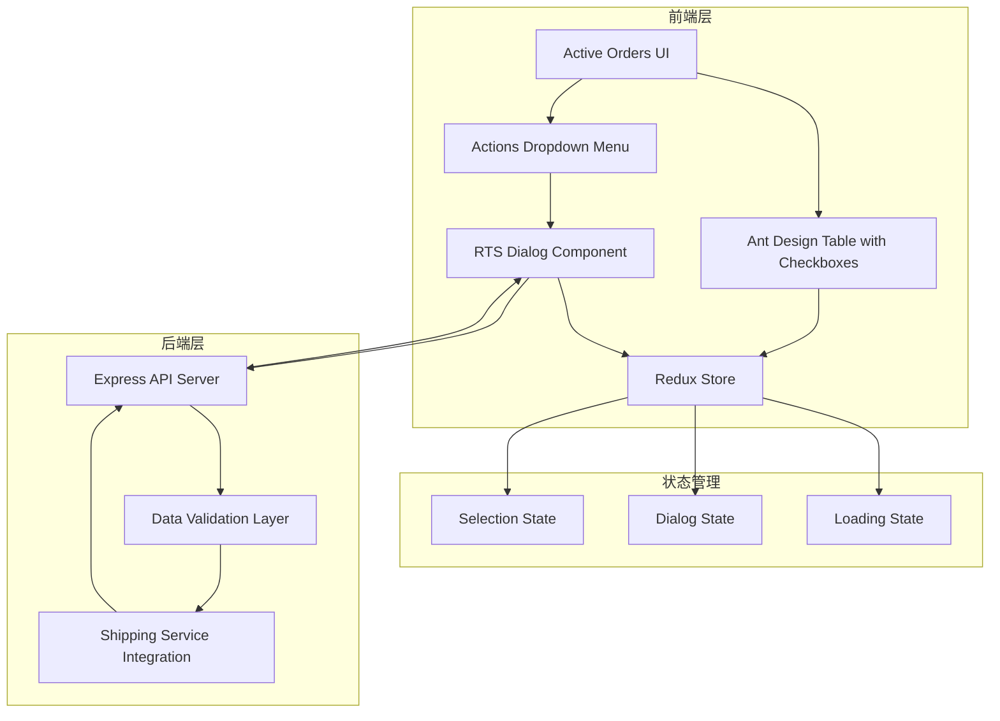

# Design Document: Return to Shipper (RTS) 功能

## Overview

本设计文档描述了 OMS Small Parcel 页面 Active Orders 列表的 Return to Shipper (RTS) 功能的技术实现方案。该功能允许用户选择一个或多个活跃订单，并为这些订单创建退货标签。

系统采用前后端分离架构：
- **前端**: React + Ant Design + Redux
- **后端**: Express + Node.js

核心功能包括：
1. 订单列表的多选功能
2. Actions 菜单集成
3. RTS 对话框展示和交互
4. 数据验证
5. 退货标签创建
6. 批量处理支持

## Architecture

### 系统架构图



### 架构层次

1. **展示层 (Presentation Layer)**
   - Active Orders 页面组件
   - Ant Design Table 组件（带复选框）
   - Actions 下拉菜单
   - RTS Dialog 组件

2. **状态管理层 (State Management Layer)**
   - Redux Store
   - Actions 和 Reducers
   - Selectors

3. **API 层 (API Layer)**
   - Express 路由
   - 请求验证中间件
   - 响应处理

4. **业务逻辑层 (Business Logic Layer)**
   - 数据验证逻辑
   - 运输服务集成
   - 错误处理

## Components and Interfaces

### 前端组件

#### 1. ActiveOrdersTable 组件

增强现有的 Active Orders 表格组件，添加选择功能。

```typescript
interface ActiveOrdersTableProps {
  orders: Order[];
  loading: boolean;
  onSelectionChange: (selectedRowKeys: string[], selectedRows: Order[]) => void;
  selectedRowKeys: string[];
}

const ActiveOrdersTable: React.FC<ActiveOrdersTableProps> = ({
  orders,
  loading,
  onSelectionChange,
  selectedRowKeys
}) => {
  const rowSelection = {
    selectedRowKeys,
    onChange: onSelectionChange,
  };

  return (
    <Table
      rowSelection={rowSelection}
      dataSource={orders}
      loading={loading}
      rowKey="id"
      columns={columns}
    />
  );
};
```

#### 2. ActionsDropdown 组件

扩展现有的 Actions 下拉菜单，添加 RTS 选项。

```typescript
interface ActionsDropdownProps {
  selectedCount: number;
  onReturnToShipper: () => void;
}

const ActionsDropdown: React.FC<ActionsDropdownProps> = ({
  selectedCount,
  onReturnToShipper
}) => {
  const menu = (
    <Menu>
      <Menu.Item
        key="rts"
        disabled={selectedCount === 0}
        onClick={onReturnToShipper}
      >
        Return to Shipper ({selectedCount} selected)
      </Menu.Item>
    </Menu>
  );

  return (
    <Dropdown overlay={menu}>
      <Button>Actions <DownOutlined /></Button>
    </Dropdown>
  );
};
```

#### 3. RTSDialog 组件

显示选中订单信息并处理退货标签创建的对话框。

```typescript
interface RTSDialogProps {
  visible: boolean;
  selectedOrders: Order[];
  loading: boolean;
  onCancel: () => void;
  onCreateReturnLabel: (orders: Order[]) => void;
}

const RTSDialog: React.FC<RTSDialogProps> = ({
  visible,
  selectedOrders,
  loading,
  onCancel,
  onCreateReturnLabel
}) => {
  const [validationErrors, setValidationErrors] = useState<ValidationError[]>([]);

  const handleCreate = () => {
    const errors = validateOrders(selectedOrders);
    if (errors.length > 0) {
      setValidationErrors(errors);
      return;
    }
    onCreateReturnLabel(selectedOrders);
  };

  return (
    <Modal
      title="Return to Shipper"
      visible={visible}
      onCancel={onCancel}
      width={800}
      footer={[
        <Button key="cancel" onClick={onCancel}>
          Cancel
        </Button>,
        <Button
          key="create"
          type="primary"
          loading={loading}
          onClick={handleCreate}
        >
          Create Return Label
        </Button>
      ]}
    >
      {selectedOrders.map((order, index) => (
        <OrderDetailsCard key={order.id} order={order} index={index} />
      ))}
      {validationErrors.length > 0 && (
        <Alert
          type="error"
          message="Validation Errors"
          description={
            <ul>
              {validationErrors.map((error, i) => (
                <li key={i}>{error.message}</li>
              ))}
            </ul>
          }
        />
      )}
    </Modal>
  );
};
```

#### 4. OrderDetailsCard 组件

显示单个订单的详细信息。

```typescript
interface OrderDetailsCardProps {
  order: Order;
  index: number;
}

const OrderDetailsCard: React.FC<OrderDetailsCardProps> = ({ order, index }) => {
  return (
    <Card title={`Order ${index + 1}`} style={{ marginBottom: 16 }}>
      <Descriptions column={2} size="small">
        <Descriptions.Item label="AIRBILL NO">
          {order.airbillNo}
        </Descriptions.Item>
        
        <Descriptions.Item label="Shipper City">
          {order.shipper.city}
        </Descriptions.Item>
        <Descriptions.Item label="Shipper State">
          {order.shipper.state}
        </Descriptions.Item>
        <Descriptions.Item label="Shipper ZIP">
          {order.shipper.zipCode}
        </Descriptions.Item>
        
        <Descriptions.Item label="Recipient City">
          {order.recipient.city}
        </Descriptions.Item>
        <Descriptions.Item label="Recipient State">
          {order.recipient.state}
        </Descriptions.Item>
        <Descriptions.Item label="Recipient ZIP">
          {order.recipient.zipCode}
        </Descriptions.Item>
        
        <Descriptions.Item label="Service Type">
          {order.serviceType}
        </Descriptions.Item>
        <Descriptions.Item label="Declared Value">
          ${order.declaredValue}
        </Descriptions.Item>
        <Descriptions.Item label="Customer Account">
          {order.customerAccountNumber}
        </Descriptions.Item>
        
        <Descriptions.Item label="Dimensions">
          {order.length}" × {order.width}" × {order.height}"
        </Descriptions.Item>
        <Descriptions.Item label="Weight">
          {order.weight} lbs
        </Descriptions.Item>
      </Descriptions>
    </Card>
  );
};
```

### Redux 状态管理

#### State 结构

```typescript
interface RTSState {
  selectedOrderIds: string[];
  dialogVisible: boolean;
  loading: boolean;
  error: string | null;
  createLabelResult: CreateLabelResult | null;
}

interface RootState {
  orders: OrdersState;
  rts: RTSState;
}
```

#### Actions

```typescript
// Action Types
const SELECT_ORDERS = 'rts/SELECT_ORDERS';
const CLEAR_SELECTION = 'rts/CLEAR_SELECTION';
const OPEN_RTS_DIALOG = 'rts/OPEN_RTS_DIALOG';
const CLOSE_RTS_DIALOG = 'rts/CLOSE_RTS_DIALOG';
const CREATE_RETURN_LABEL_REQUEST = 'rts/CREATE_RETURN_LABEL_REQUEST';
const CREATE_RETURN_LABEL_SUCCESS = 'rts/CREATE_RETURN_LABEL_SUCCESS';
const CREATE_RETURN_LABEL_FAILURE = 'rts/CREATE_RETURN_LABEL_FAILURE';

// Action Creators
const selectOrders = (orderIds: string[]) => ({
  type: SELECT_ORDERS,
  payload: orderIds
});

const clearSelection = () => ({
  type: CLEAR_SELECTION
});

const openRTSDialog = () => ({
  type: OPEN_RTS_DIALOG
});

const closeRTSDialog = () => ({
  type: CLOSE_RTS_DIALOG
});

const createReturnLabelRequest = () => ({
  type: CREATE_RETURN_LABEL_REQUEST
});

const createReturnLabelSuccess = (result: CreateLabelResult) => ({
  type: CREATE_RETURN_LABEL_SUCCESS,
  payload: result
});

const createReturnLabelFailure = (error: string) => ({
  type: CREATE_RETURN_LABEL_FAILURE,
  payload: error
});
```

#### Thunk Actions

```typescript
const createReturnLabels = (orders: Order[]) => {
  return async (dispatch: Dispatch) => {
    dispatch(createReturnLabelRequest());
    
    try {
      const response = await fetch('/api/orders/return-to-shipper', {
        method: 'POST',
        headers: {
          'Content-Type': 'application/json'
        },
        body: JSON.stringify({ orders })
      });
      
      if (!response.ok) {
        const error = await response.json();
        throw new Error(error.message);
      }
      
      const result = await response.json();
      dispatch(createReturnLabelSuccess(result));
      dispatch(closeRTSDialog());
      dispatch(clearSelection());
      message.success(`Successfully created ${result.successCount} return label(s)`);
      
      // Refresh orders list
      dispatch(fetchOrders());
    } catch (error) {
      dispatch(createReturnLabelFailure(error.message));
      message.error(`Failed to create return labels: ${error.message}`);
    }
  };
};
```

#### Reducer

```typescript
const initialState: RTSState = {
  selectedOrderIds: [],
  dialogVisible: false,
  loading: false,
  error: null,
  createLabelResult: null
};

const rtsReducer = (state = initialState, action: RTSAction): RTSState => {
  switch (action.type) {
    case SELECT_ORDERS:
      return {
        ...state,
        selectedOrderIds: action.payload
      };
    
    case CLEAR_SELECTION:
      return {
        ...state,
        selectedOrderIds: []
      };
    
    case OPEN_RTS_DIALOG:
      return {
        ...state,
        dialogVisible: true,
        error: null
      };
    
    case CLOSE_RTS_DIALOG:
      return {
        ...state,
        dialogVisible: false,
        createLabelResult: null
      };
    
    case CREATE_RETURN_LABEL_REQUEST:
      return {
        ...state,
        loading: true,
        error: null
      };
    
    case CREATE_RETURN_LABEL_SUCCESS:
      return {
        ...state,
        loading: false,
        createLabelResult: action.payload
      };
    
    case CREATE_RETURN_LABEL_FAILURE:
      return {
        ...state,
        loading: false,
        error: action.payload
      };
    
    default:
      return state;
  }
};
```

#### Selectors

```typescript
const selectSelectedOrderIds = (state: RootState) => state.rts.selectedOrderIds;

const selectSelectedOrders = (state: RootState) => {
  const selectedIds = state.rts.selectedOrderIds;
  return state.orders.items.filter(order => selectedIds.includes(order.id));
};

const selectDialogVisible = (state: RootState) => state.rts.dialogVisible;

const selectLoading = (state: RootState) => state.rts.loading;

const selectError = (state: RootState) => state.rts.error;
```

### 后端 API

#### API 端点

```typescript
// POST /api/orders/return-to-shipper
interface CreateReturnLabelRequest {
  orders: Order[];
}

interface CreateReturnLabelResponse {
  successCount: number;
  failureCount: number;
  results: ReturnLabelResult[];
}

interface ReturnLabelResult {
  orderId: string;
  success: boolean;
  trackingNumber?: string;
  labelUrl?: string;
  error?: string;
}
```

#### Express 路由实现

```typescript
router.post('/api/orders/return-to-shipper', async (req, res) => {
  try {
    const { orders } = req.body;
    
    // Validate request
    if (!orders || !Array.isArray(orders) || orders.length === 0) {
      return res.status(400).json({
        error: 'Invalid request: orders array is required'
      });
    }
    
    // Validate each order
    const validationErrors = validateOrders(orders);
    if (validationErrors.length > 0) {
      return res.status(400).json({
        error: 'Validation failed',
        details: validationErrors
      });
    }
    
    // Process each order
    const results = await Promise.allSettled(
      orders.map(order => createReturnLabel(order))
    );
    
    // Aggregate results
    const response = aggregateResults(results);
    
    res.json(response);
  } catch (error) {
    console.error('Error creating return labels:', error);
    res.status(500).json({
      error: 'Internal server error',
      message: error.message
    });
  }
});
```

#### 数据验证函数

```typescript
interface ValidationError {
  orderId: string;
  field: string;
  message: string;
}

const validateOrders = (orders: Order[]): ValidationError[] => {
  const errors: ValidationError[] = [];
  
  orders.forEach(order => {
    // Validate required fields
    if (!order.airbillNo) {
      errors.push({
        orderId: order.id,
        field: 'airbillNo',
        message: 'Airbill number is required'
      });
    }
    
    // Validate shipper information
    if (!order.shipper.city || !order.shipper.state || !order.shipper.zipCode) {
      errors.push({
        orderId: order.id,
        field: 'shipper',
        message: 'Complete shipper address is required'
      });
    }
    
    // Validate ZIP code format
    if (order.shipper.zipCode && !isValidZipCode(order.shipper.zipCode)) {
      errors.push({
        orderId: order.id,
        field: 'shipper.zipCode',
        message: 'Invalid ZIP code format'
      });
    }
    
    if (order.recipient.zipCode && !isValidZipCode(order.recipient.zipCode)) {
      errors.push({
        orderId: order.id,
        field: 'recipient.zipCode',
        message: 'Invalid ZIP code format'
      });
    }
    
    // Validate weight
    if (!order.weight || order.weight <= 0) {
      errors.push({
        orderId: order.id,
        field: 'weight',
        message: 'Weight must be a positive number'
      });
    }
    
    // Validate dimensions
    if (!order.length || order.length <= 0 ||
        !order.width || order.width <= 0 ||
        !order.height || order.height <= 0) {
      errors.push({
        orderId: order.id,
        field: 'dimensions',
        message: 'All dimensions must be positive numbers'
      });
    }
  });
  
  return errors;
};

const isValidZipCode = (zipCode: string): boolean => {
  // US ZIP code: 5 digits or 5+4 format
  const zipRegex = /^\d{5}(-\d{4})?$/;
  return zipRegex.test(zipCode);
};
```

#### 运输服务集成

```typescript
const createReturnLabel = async (order: Order): Promise<ReturnLabelResult> => {
  try {
    // Call shipping service API (e.g., FedEx, UPS)
    const response = await shippingServiceClient.createReturnLabel({
      airbillNo: order.airbillNo,
      shipper: order.shipper,
      recipient: order.recipient,
      serviceType: order.serviceType,
      declaredValue: order.declaredValue,
      customerAccountNumber: order.customerAccountNumber,
      dimensions: {
        length: order.length,
        width: order.width,
        height: order.height
      },
      weight: order.weight
    });
    
    return {
      orderId: order.id,
      success: true,
      trackingNumber: response.trackingNumber,
      labelUrl: response.labelUrl
    };
  } catch (error) {
    return {
      orderId: order.id,
      success: false,
      error: error.message
    };
  }
};

const aggregateResults = (
  results: PromiseSettledResult<ReturnLabelResult>[]
): CreateReturnLabelResponse => {
  const labelResults: ReturnLabelResult[] = [];
  let successCount = 0;
  let failureCount = 0;
  
  results.forEach(result => {
    if (result.status === 'fulfilled') {
      labelResults.push(result.value);
      if (result.value.success) {
        successCount++;
      } else {
        failureCount++;
      }
    } else {
      failureCount++;
      labelResults.push({
        orderId: 'unknown',
        success: false,
        error: result.reason.message
      });
    }
  });
  
  return {
    successCount,
    failureCount,
    results: labelResults
  };
};
```

## Data Models

### Order 数据模型

```typescript
interface Order {
  id: string;
  airbillNo: string;
  shipper: Address;
  recipient: Address;
  serviceType: string;
  declaredValue: number;
  customerAccountNumber: string;
  length: number;
  width: number;
  height: number;
  weight: number;
  status: OrderStatus;
  createdAt: Date;
  updatedAt: Date;
}

interface Address {
  name?: string;
  company?: string;
  address1?: string;
  address2?: string;
  city: string;
  state: string;
  zipCode: string;
  country?: string;
}

enum OrderStatus {
  ACTIVE = 'ACTIVE',
  ARCHIVED = 'ARCHIVED',
  RETURNED = 'RETURNED',
  CANCELLED = 'CANCELLED'
}
```

### RTS 相关数据模型

```typescript
interface CreateReturnLabelRequest {
  orders: Order[];
}

interface CreateReturnLabelResponse {
  successCount: number;
  failureCount: number;
  results: ReturnLabelResult[];
}

interface ReturnLabelResult {
  orderId: string;
  success: boolean;
  trackingNumber?: string;
  labelUrl?: string;
  error?: string;
}

interface ValidationError {
  orderId: string;
  field: string;
  message: string;
}
```


## Correctness Properties

属性（Property）是关于系统行为的特征或规则，应该在所有有效执行中保持为真。属性是人类可读规范和机器可验证正确性保证之间的桥梁。

### UI 交互属性

**Property 1: 复选框渲染完整性**
*For any* 订单列表，当渲染 Active Orders 表格时，每一行都应该包含一个可交互的复选框元素。
**Validates: Requirements 1.1**

**Property 2: 复选框状态切换**
*For any* 订单和任意初始选中状态，点击该订单的复选框应该切换其选中状态（选中变为未选中，未选中变为选中）。
**Validates: Requirements 1.2**

**Property 3: 全选功能正确性**
*For any* 订单列表，点击全选复选框应该：如果当前未全选则选中所有订单；如果当前已全选则取消所有选中。
**Validates: Requirements 1.3**

**Property 4: 选中数量显示准确性**
*For any* 非空的选中订单集合，UI 显示的选中数量应该等于实际选中的订单数量。
**Validates: Requirements 1.4**

**Property 5: 选中状态清空**
*For any* 订单列表，当所有订单都被取消选中时，选中订单列表应该为空数组。
**Validates: Requirements 1.5**

**Property 6: RTS 按钮启用状态**
*For any* 选中订单集合，当且仅当选中订单数量大于 0 时，"Return to Shipper" 选项应该处于启用状态。
**Validates: Requirements 2.3**

**Property 7: 对话框打开触发**
*For any* 非空选中订单集合，点击 "Return to Shipper" 选项应该将对话框可见状态设置为 true。
**Validates: Requirements 2.4**

### 数据显示属性

**Property 8: 对话框订单信息完整性**
*For any* 选中的订单集合，RTS 对话框应该显示所有这些订单的信息，且每个订单都应该包含以下所有必需字段：
- 发货人信息：AIRBILL NO, CITY, STATE, ZIP CODE
- 收货人信息：CITY, STATE, ZIP CODE
- 运输信息：SERVICE TYPE, DECLARED VALUE, CUSTOMER ACCOUNT NUMBER, LENGTH, WIDTH, HEIGHT, WEIGHT

**Validates: Requirements 3.1, 3.2, 3.3, 3.4**

**Property 9: 多订单独立显示**
*For any* 包含多个订单的选中集合，对话框中每个订单的信息应该在独立的显示区域中（例如独立的 Card 组件），且订单数量应该与选中数量一致。
**Validates: Requirements 3.5**

### 数据验证属性

**Property 10: 必填字段验证**
*For any* 订单，如果任何必填字段（airbillNo, shipper.city, shipper.state, shipper.zipCode, recipient.city, recipient.state, recipient.zipCode, serviceType, weight, dimensions）为空或 undefined，验证函数应该返回相应的验证错误。
**Validates: Requirements 4.1**

**Property 11: 邮编格式验证**
*For any* 邮编字符串，验证函数应该接受符合美国邮编标准的格式（5位数字如 "12345" 或 5+4 格式如 "12345-6789"），并拒绝其他格式。
**Validates: Requirements 4.2**

**Property 12: 数值字段正数验证**
*For any* 订单，如果重量、长度、宽度或高度字段的值小于或等于 0，验证函数应该返回相应的验证错误。
**Validates: Requirements 4.3, 4.4**

**Property 13: 验证错误阻止提交**
*For any* 包含验证错误的订单集合，点击 "Create Return Label" 按钮应该显示错误信息并且不触发 API 调用。
**Validates: Requirements 4.5**

### API 交互属性

**Property 14: 有效订单触发 API 调用**
*For any* 通过所有验证的订单集合，点击 "Create Return Label" 按钮应该触发向 `/api/orders/return-to-shipper` 端点的 POST 请求。
**Validates: Requirements 5.1**

**Property 15: 成功响应处理**
*For any* API 成功响应，系统应该显示成功消息、关闭对话框、清空选中列表，并刷新订单列表。
**Validates: Requirements 5.2, 5.5**

**Property 16: 错误响应处理**
*For any* API 错误响应，系统应该显示错误消息并保持对话框打开状态。
**Validates: Requirements 5.3**

**Property 17: 取消操作清理**
*For any* 对话框打开状态，点击 "Cancel" 按钮应该关闭对话框并清空选中订单列表。
**Validates: Requirements 5.4**

### 批量处理属性

**Property 18: 批量操作支持**
*For any* 包含多个订单的选中集合，系统应该能够处理批量创建退货标签请求，并为所有订单生成结果。
**Validates: Requirements 6.1**

**Property 19: 部分失败结果显示**
*For any* 批量操作结果，如果包含成功和失败的混合结果，系统应该显示每个订单的详细状态（成功或失败及原因）。
**Validates: Requirements 6.3**

**Property 20: 批量操作摘要准确性**
*For any* 批量操作结果，显示的成功数量和失败数量之和应该等于处理的订单总数，且每个计数应该与实际结果匹配。
**Validates: Requirements 6.4**

**Property 21: 批量操作加载状态**
*For any* 批量操作，在操作进行期间（从请求发送到响应接收），系统应该显示加载指示器。
**Validates: Requirements 6.5**

### 状态管理属性

**Property 22: Redux 状态同步**
*For any* 状态变化（选中订单、对话框可见性、加载状态、错误状态），相应的 Redux store 应该在状态变化后立即反映最新值。
**Validates: Requirements 7.1, 7.2, 7.3, 7.4**

**Property 23: 组件卸载清理**
*For any* 组件卸载事件，Redux store 中的临时状态（选中订单列表、对话框状态、错误信息）应该被重置为初始值。
**Validates: Requirements 7.5**

### 后端 API 属性

**Property 24: 后端请求验证**
*For any* 发送到 `/api/orders/return-to-shipper` 的请求，如果请求体缺少 orders 数组或 orders 为空，后端应该返回 400 状态码和验证错误信息。
**Validates: Requirements 8.2**

**Property 25: 后端成功响应格式**
*For any* 有效的退货标签创建请求，如果运输服务 API 调用成功，后端应该返回包含 trackingNumber 和 labelUrl 的响应对象。
**Validates: Requirements 8.3, 8.4**

**Property 26: 后端错误响应格式**
*For any* 无效请求或运输服务 API 失败，后端应该返回适当的 HTTP 错误状态码（400 用于验证错误，500 用于服务器错误）和包含错误信息的响应体。
**Validates: Requirements 8.5**

## Error Handling

### 前端错误处理

#### 1. 验证错误

```typescript
// 在用户尝试创建标签前进行客户端验证
const handleCreateLabel = () => {
  const errors = validateOrders(selectedOrders);
  
  if (errors.length > 0) {
    // 显示验证错误
    setValidationErrors(errors);
    message.error('Please fix validation errors before proceeding');
    return;
  }
  
  // 继续创建标签
  dispatch(createReturnLabels(selectedOrders));
};
```

#### 2. 网络错误

```typescript
// 在 Redux thunk 中处理网络错误
const createReturnLabels = (orders: Order[]) => {
  return async (dispatch: Dispatch) => {
    dispatch(createReturnLabelRequest());
    
    try {
      const response = await fetch('/api/orders/return-to-shipper', {
        method: 'POST',
        headers: { 'Content-Type': 'application/json' },
        body: JSON.stringify({ orders })
      });
      
      if (!response.ok) {
        const error = await response.json();
        throw new Error(error.message || 'Failed to create return labels');
      }
      
      const result = await response.json();
      dispatch(createReturnLabelSuccess(result));
      
      // 显示成功消息
      if (result.failureCount > 0) {
        message.warning(
          `Created ${result.successCount} label(s), ${result.failureCount} failed`
        );
      } else {
        message.success(`Successfully created ${result.successCount} return label(s)`);
      }
    } catch (error) {
      dispatch(createReturnLabelFailure(error.message));
      message.error(`Error: ${error.message}`);
    }
  };
};
```

#### 3. 部分失败处理

```typescript
// 在对话框中显示详细的批量操作结果
const ResultsSummary: React.FC<{ results: ReturnLabelResult[] }> = ({ results }) => {
  const successResults = results.filter(r => r.success);
  const failureResults = results.filter(r => !r.success);
  
  return (
    <div>
      {successResults.length > 0 && (
        <Alert
          type="success"
          message={`${successResults.length} label(s) created successfully`}
          description={
            <ul>
              {successResults.map(r => (
                <li key={r.orderId}>
                  Order {r.orderId}: Tracking #{r.trackingNumber}
                </li>
              ))}
            </ul>
          }
        />
      )}
      
      {failureResults.length > 0 && (
        <Alert
          type="error"
          message={`${failureResults.length} label(s) failed`}
          description={
            <ul>
              {failureResults.map(r => (
                <li key={r.orderId}>
                  Order {r.orderId}: {r.error}
                </li>
              ))}
            </ul>
          }
        />
      )}
    </div>
  );
};
```

### 后端错误处理

#### 1. 请求验证错误

```typescript
router.post('/api/orders/return-to-shipper', async (req, res) => {
  try {
    const { orders } = req.body;
    
    // 验证请求格式
    if (!orders || !Array.isArray(orders) || orders.length === 0) {
      return res.status(400).json({
        error: 'Bad Request',
        message: 'orders array is required and must not be empty'
      });
    }
    
    // 验证订单数据
    const validationErrors = validateOrders(orders);
    if (validationErrors.length > 0) {
      return res.status(400).json({
        error: 'Validation Failed',
        message: 'One or more orders have invalid data',
        details: validationErrors
      });
    }
    
    // 继续处理...
  } catch (error) {
    // 错误处理...
  }
});
```

#### 2. 运输服务 API 错误

```typescript
const createReturnLabel = async (order: Order): Promise<ReturnLabelResult> => {
  try {
    const response = await shippingServiceClient.createReturnLabel({
      // ... 参数
    });
    
    return {
      orderId: order.id,
      success: true,
      trackingNumber: response.trackingNumber,
      labelUrl: response.labelUrl
    };
  } catch (error) {
    // 记录详细错误
    console.error(`Failed to create return label for order ${order.id}:`, error);
    
    // 返回失败结果而不是抛出异常
    return {
      orderId: order.id,
      success: false,
      error: error.message || 'Unknown error occurred'
    };
  }
};
```

#### 3. 服务器错误

```typescript
router.post('/api/orders/return-to-shipper', async (req, res) => {
  try {
    // ... 处理逻辑
  } catch (error) {
    console.error('Unexpected error in return-to-shipper endpoint:', error);
    
    res.status(500).json({
      error: 'Internal Server Error',
      message: 'An unexpected error occurred while processing your request',
      // 在开发环境中包含详细错误信息
      ...(process.env.NODE_ENV === 'development' && {
        details: error.message,
        stack: error.stack
      })
    });
  }
});
```

### 错误恢复策略

1. **自动重试**: 对于网络临时故障，可以实现自动重试机制
2. **用户反馈**: 始终向用户提供清晰的错误信息和可能的解决方案
3. **状态恢复**: 错误发生后保持 UI 状态，允许用户修正后重试
4. **日志记录**: 记录所有错误以便调试和监控

## Testing Strategy

### 测试方法

本项目采用双重测试策略，结合单元测试和基于属性的测试（Property-Based Testing, PBT）：

- **单元测试**: 验证特定示例、边缘情况和错误条件
- **属性测试**: 验证跨所有输入的通用属性

两者互补，共同提供全面的测试覆盖：
- 单元测试捕获具体的 bug
- 属性测试验证通用正确性

### 测试框架选择

#### 前端测试
- **测试框架**: Jest
- **React 测试**: React Testing Library
- **属性测试库**: fast-check
- **Redux 测试**: Redux Mock Store

#### 后端测试
- **测试框架**: Jest
- **API 测试**: Supertest
- **属性测试库**: fast-check

### 属性测试配置

每个属性测试必须：
1. 运行至少 100 次迭代（由于随机化）
2. 使用注释标签引用设计文档中的属性
3. 标签格式：`Feature: return-to-shipper, Property {number}: {property_text}`

示例：
```typescript
// Feature: return-to-shipper, Property 2: 复选框状态切换
test('checkbox toggle switches selection state', () => {
  fc.assert(
    fc.property(
      fc.array(orderArbitrary),
      fc.integer({ min: 0, max: 10 }),
      fc.boolean(),
      (orders, index, initialState) => {
        // 测试逻辑
      }
    ),
    { numRuns: 100 }
  );
});
```

### 测试覆盖范围

#### 前端组件测试

**ActiveOrdersTable 组件**
- 单元测试：
  - 渲染空订单列表
  - 渲染包含订单的列表
  - 复选框点击事件
  - 全选功能
- 属性测试：
  - Property 1: 复选框渲染完整性
  - Property 2: 复选框状态切换
  - Property 3: 全选功能正确性

**ActionsDropdown 组件**
- 单元测试：
  - 无选中时按钮禁用
  - 有选中时按钮启用
  - 点击触发回调
- 属性测试：
  - Property 6: RTS 按钮启用状态

**RTSDialog 组件**
- 单元测试：
  - 对话框打开/关闭
  - 取消按钮功能
  - 创建按钮加载状态
  - 验证错误显示
- 属性测试：
  - Property 8: 对话框订单信息完整性
  - Property 9: 多订单独立显示
  - Property 13: 验证错误阻止提交
  - Property 17: 取消操作清理

**OrderDetailsCard 组件**
- 单元测试：
  - 所有字段正确显示
  - 格式化（货币、尺寸、重量）

#### Redux 状态管理测试

**Actions 测试**
- 单元测试：每个 action creator 返回正确的 action 对象

**Reducer 测试**
- 单元测试：
  - 初始状态
  - 每个 action 的状态转换
- 属性测试：
  - Property 22: Redux 状态同步

**Thunk Actions 测试**
- 单元测试：
  - API 调用成功场景
  - API 调用失败场景
  - 批量操作部分失败
- 属性测试：
  - Property 14: 有效订单触发 API 调用
  - Property 15: 成功响应处理
  - Property 16: 错误响应处理

**Selectors 测试**
- 单元测试：每个 selector 从状态中提取正确的数据
- 属性测试：
  - Property 4: 选中数量显示准确性

#### 数据验证测试

**validateOrders 函数**
- 单元测试：
  - 有效订单通过验证
  - 缺少必填字段
  - 无效邮编格式
  - 负数重量/尺寸
- 属性测试：
  - Property 10: 必填字段验证
  - Property 11: 邮编格式验证
  - Property 12: 数值字段正数验证

**isValidZipCode 函数**
- 单元测试：
  - 有效的 5 位邮编
  - 有效的 5+4 邮编
  - 无效格式
- 属性测试：
  - Property 11: 邮编格式验证

#### 后端 API 测试

**POST /api/orders/return-to-shipper 端点**
- 单元测试：
  - 成功创建单个标签
  - 成功创建多个标签
  - 缺少 orders 参数
  - 空 orders 数组
  - 验证失败
  - 运输服务 API 失败
- 属性测试：
  - Property 24: 后端请求验证
  - Property 25: 后端成功响应格式
  - Property 26: 后端错误响应格式

**createReturnLabel 函数**
- 单元测试：
  - 成功调用运输服务 API
  - 运输服务 API 返回错误
  - 网络超时
- 属性测试：
  - Property 18: 批量操作支持

**aggregateResults 函数**
- 单元测试：
  - 全部成功
  - 全部失败
  - 部分成功部分失败
- 属性测试：
  - Property 19: 部分失败结果显示
  - Property 20: 批量操作摘要准确性

### 集成测试

**端到端流程测试**
1. 用户选择订单 → 打开对话框 → 创建标签 → 刷新列表
2. 用户选择多个订单 → 批量创建 → 显示结果摘要
3. 验证失败 → 显示错误 → 修正后重试
4. API 失败 → 显示错误 → 保持对话框打开

### 测试数据生成

使用 fast-check 的 arbitrary 生成器创建测试数据：

```typescript
// 订单数据生成器
const addressArbitrary = fc.record({
  city: fc.string({ minLength: 1, maxLength: 50 }),
  state: fc.constantFrom('CA', 'NY', 'TX', 'FL', 'IL'),
  zipCode: fc.oneof(
    fc.tuple(fc.integer({ min: 10000, max: 99999 })).map(([n]) => n.toString()),
    fc.tuple(
      fc.integer({ min: 10000, max: 99999 }),
      fc.integer({ min: 1000, max: 9999 })
    ).map(([a, b]) => `${a}-${b}`)
  )
});

const orderArbitrary = fc.record({
  id: fc.uuid(),
  airbillNo: fc.string({ minLength: 10, maxLength: 20 }),
  shipper: addressArbitrary,
  recipient: addressArbitrary,
  serviceType: fc.constantFrom('Ground', 'Express', 'Overnight'),
  declaredValue: fc.float({ min: 0, max: 10000 }),
  customerAccountNumber: fc.string({ minLength: 8, maxLength: 12 }),
  length: fc.float({ min: 1, max: 100 }),
  width: fc.float({ min: 1, max: 100 }),
  height: fc.float({ min: 1, max: 100 }),
  weight: fc.float({ min: 0.1, max: 150 }),
  status: fc.constant('ACTIVE'),
  createdAt: fc.date(),
  updatedAt: fc.date()
});
```

### 测试执行

```bash
# 运行所有测试
npm test

# 运行前端测试
npm test -- --testPathPattern=src/

# 运行后端测试
npm test -- --testPathPattern=server/

# 运行属性测试
npm test -- --testNamePattern="Property"

# 生成覆盖率报告
npm test -- --coverage
```

### 持续集成

在 CI/CD 管道中：
1. 每次提交运行所有测试
2. 要求测试覆盖率 > 80%
3. 属性测试失败时阻止合并
4. 定期运行更多迭代的属性测试（例如 1000 次）


## Print Airbills Page Design

### 概述

Print Airbills 页面是一个专门的打印预览页面，在用户成功创建退货标签后自动打开。该页面显示格式化的运输标签，可以直接打印或保存为 PDF。

### 页面结构

```typescript
interface PrintAirbillsPageProps {
  labels: ReturnLabel[];
  onExit: () => void;
  onPrint: () => void;
}

interface ReturnLabel {
  airbillNo: string;
  barcode: string;
  shipper: {
    name: string;
    company?: string;
    address1: string;
    address2?: string;
    city: string;
    state: string;
    zipCode: string;
  };
  recipient: {
    name: string;
    company?: string;
    address1: string;
    address2?: string;
    city: string;
    state: string;
    zipCode: string;
  };
  serviceType: string;
  printDate: string;
  packageNumber: string;
  refNumber: string;
  weight: number;
  dimensions: {
    length: number;
    width: number;
    height: number;
  };
  ref2?: string;
}
```

### 组件实现

#### PrintAirbillsPage 组件

```typescript
const PrintAirbillsPage: React.FC<PrintAirbillsPageProps> = ({
  labels,
  onExit,
  onPrint
}) => {
  const handlePrint = () => {
    window.print();
    onPrint();
  };

  return (
    <div className="print-airbills-page">
      <div className="print-header no-print">
        <h1>Print Airbills</h1>
      </div>
      
      <div className="airbills-container">
        {labels.map((label, index) => (
          <AirbillLabel
            key={label.airbillNo}
            label={label}
            index={index + 1}
          />
        ))}
      </div>
      
      <div className="print-actions no-print">
        <Button onClick={onExit}>Exit</Button>
        <Button type="primary" onClick={handlePrint}>Print</Button>
      </div>
    </div>
  );
};
```

#### AirbillLabel 组件

```typescript
interface AirbillLabelProps {
  label: ReturnLabel;
  index: number;
}

const AirbillLabel: React.FC<AirbillLabelProps> = ({ label, index }) => {
  return (
    <div className="airbill-label page-break">
      <div className="airbill-header">
        <h2>Airbill #{index}</h2>
      </div>
      
      <div className="label-content">
        {/* LSO Logo */}
        <div className="logo-section">
          
        </div>
        
        {/* Barcode */}
        <div className="barcode-section">
          <Barcode value={label.airbillNo} format="CODE128" />
          <div className="airbill-number">Airbill No: {label.airbillNo}</div>
        </div>
        
        {/* Shipper Address */}
        <div className="address-section shipper">
          <div className="address-label">SHIP TO:</div>
          <div className="address-content">
            <div>{label.shipper.name}</div>
            {label.shipper.company && <div>{label.shipper.company}</div>}
            <div>{label.shipper.address1}</div>
            {label.shipper.address2 && <div>{label.shipper.address2}</div>}
            <div>
              {label.shipper.city}, {label.shipper.state} {label.shipper.zipCode}
            </div>
          </div>
        </div>
        
        {/* Recipient Address (in barcode area) */}
        <div className="address-section recipient">
          <div className="address-content">
            <div>{label.recipient.city}</div>
            <div>{label.recipient.state}</div>
            <div>{label.recipient.zipCode}</div>
          </div>
        </div>
        
        {/* Service Type Banner */}
        <div className="service-banner">
          <div className="service-icon">W AUS</div>
          <div className="service-text">
            <div className="service-type">{label.serviceType}</div>
            <div className="service-description">END OF BUSINESS DAY DELIVERY</div>
          </div>
        </div>
        
        {/* Package Details */}
        <div className="package-details">
          <div className="detail-row">
            <span className="detail-label">PRINT DATE:</span>
            <span className="detail-value">{label.printDate}</span>
          </div>
          <div className="detail-row">
            <span className="detail-label">PACKAGE:</span>
            <span className="detail-value">{label.packageNumber}</span>
          </div>
          <div className="detail-row">
            <span className="detail-label">REF#:</span>
            <span className="detail-value">{label.refNumber}</span>
          </div>
          <div className="detail-row">
            <span className="detail-label">WEIGHT:</span>
            <span className="detail-value">{label.weight} LBS</span>
          </div>
          <div className="detail-row">
            <span className="detail-label">DIMENSIONS:</span>
            <span className="detail-value">
              {label.dimensions.length}" × {label.dimensions.width}" × {label.dimensions.height}"
            </span>
          </div>
          {label.ref2 && (
            <div className="detail-row">
              <span className="detail-label">REF 2:</span>
              <span className="detail-value">{label.ref2}</span>
            </div>
          )}
        </div>
        
        {/* Instructions */}
        <div className="instructions">
          <p>
            Fold on above line and place shipping label in pouch on package. 
            Please be sure the barcodes and addresses can be read and scanned.
          </p>
          <ol>
            <li>Fold this edge along the horizontal line above.</li>
            <li>Place this label in the shipping label pouch on the package you are shipping. 
                Please be sure the barcodes and addresses can be read and scanned.</li>
            <li>To create a drop box near you, click on Find Drop Box from the home page main menu.</li>
            <li>To schedule a pickup, click on Request Pickup.</li>
          </ol>
        </div>
        
        {/* Warning and Liability */}
        <div className="warning-section">
          <p className="warning-text">
            <strong>WARNING:</strong> Use only the printed mailing label for shipping. 
            Using a photocopy of this label for shipping purposes is fraudulent and could result 
            in additional billing charges, along with the cancellation of your Lone Star Overnight account number.
          </p>
          <p className="liability-text">
            <strong>LIMIT OF LIABILITY:</strong> We are not responsible for claims in excess of $100.00 
            for any item unless you: 1) declare a greater value (not to exceed $25,000); 2) pay an additional fee; 
            3) and document actual loss in a timely manner. We will not pay any claim in excess of the actual loss. 
            We are not liable for any special or consequential damages. Additional limitations of liability are 
            contained in our current Service Guide. If you are to deliver a package without obtaining a delivery 
            signature, you release us of all liability for claims resulting from such service. 
            NO DELIVERY SIGNATURE WILL BE OBTAINED FOR 2-DAY AM DELIVERIES OR RESIDENTIAL DELIVERIES.
          </p>
        </div>
      </div>
    </div>
  );
};
```

### 样式设计

```css
/* Print Airbills Page Styles */
.print-airbills-page {
  background: #f5f5f5;
  min-height: 100vh;
  padding: 20px;
}

.print-header {
  text-align: center;
  margin-bottom: 20px;
}

.print-header h1 {
  font-size: 24px;
  font-weight: 600;
  color: #333;
}

.airbills-container {
  max-width: 8.5in;
  margin: 0 auto;
}

.airbill-label {
  background: white;
  padding: 0.5in;
  margin-bottom: 20px;
  box-shadow: 0 2px 8px rgba(0, 0, 0, 0.1);
}

.airbill-header h2 {
  font-size: 18px;
  font-weight: 600;
  margin-bottom: 20px;
  color: #666;
}

.label-content {
  border: 2px solid #000;
  padding: 20px;
}

.logo-section {
  margin-bottom: 15px;
}

.lso-logo {
  height: 40px;
}

.barcode-section {
  text-align: center;
  margin: 20px 0;
  padding: 10px;
  border: 1px solid #ddd;
}

.airbill-number {
  margin-top: 10px;
  font-size: 14px;
  font-weight: 600;
}

.address-section {
  margin: 15px 0;
  padding: 10px;
  border: 1px solid #000;
}

.address-label {
  font-weight: 700;
  font-size: 12px;
  margin-bottom: 5px;
}

.address-content {
  font-size: 11px;
  line-height: 1.4;
}

.address-content div {
  margin: 2px 0;
}

.service-banner {
  display: flex;
  align-items: center;
  background: #000;
  color: #fff;
  padding: 10px;
  margin: 15px 0;
}

.service-icon {
  font-size: 24px;
  font-weight: 700;
  padding: 5px 15px;
  border: 2px solid #fff;
  margin-right: 15px;
}

.service-type {
  font-size: 14px;
  font-weight: 700;
}

.service-description {
  font-size: 11px;
}

.package-details {
  margin: 15px 0;
  font-size: 10px;
}

.detail-row {
  display: flex;
  padding: 3px 0;
  border-bottom: 1px solid #eee;
}

.detail-label {
  font-weight: 700;
  width: 120px;
}

.detail-value {
  flex: 1;
}

.instructions {
  margin: 15px 0;
  padding: 10px;
  background: #f9f9f9;
  border: 1px solid #ddd;
  font-size: 9px;
  line-height: 1.4;
}

.instructions p {
  margin-bottom: 10px;
}

.instructions ol {
  margin-left: 20px;
}

.instructions li {
  margin: 5px 0;
}

.warning-section {
  margin-top: 15px;
  font-size: 8px;
  line-height: 1.3;
}

.warning-text {
  margin-bottom: 10px;
  padding: 5px;
  background: #fff3cd;
  border: 1px solid #ffc107;
}

.liability-text {
  padding: 5px;
  background: #f8f9fa;
  border: 1px solid #dee2e6;
}

.print-actions {
  text-align: center;
  margin-top: 30px;
  padding: 20px;
}

.print-actions button {
  margin: 0 10px;
  min-width: 120px;
}

/* Print-specific styles */
@media print {
  .no-print {
    display: none !important;
  }
  
  .print-airbills-page {
    background: white;
    padding: 0;
  }
  
  .airbill-label {
    box-shadow: none;
    margin: 0;
    padding: 0;
  }
  
  .page-break {
    page-break-after: always;
  }
  
  .page-break:last-child {
    page-break-after: auto;
  }
  
  @page {
    size: letter;
    margin: 0.5in;
  }
}
```

### 路由集成

```typescript
// 在 React Router 中添加打印页面路由
<Route path="/print-airbills" element={<PrintAirbillsPage />} />
```

### Redux 集成

```typescript
// 在 Redux thunk 中处理标签创建成功后的导航
const createReturnLabels = (orders: Order[]) => {
  return async (dispatch: Dispatch, getState: () => RootState) => {
    dispatch(createReturnLabelRequest());
    
    try {
      const response = await fetch('/api/orders/return-to-shipper', {
        method: 'POST',
        headers: { 'Content-Type': 'application/json' },
        body: JSON.stringify({ orders })
      });
      
      if (!response.ok) {
        throw new Error('Failed to create return labels');
      }
      
      const result = await response.json();
      dispatch(createReturnLabelSuccess(result));
      dispatch(closeRTSDialog());
      dispatch(clearSelection());
      
      // 导航到打印页面
      navigate('/print-airbills', {
        state: { labels: result.labels }
      });
    } catch (error) {
      dispatch(createReturnLabelFailure(error.message));
      message.error(`Error: ${error.message}`);
    }
  };
};
```

### 条形码生成

使用 `react-barcode` 库生成条形码：

```bash
npm install react-barcode
```

```typescript
import Barcode from 'react-barcode';

<Barcode
  value={label.airbillNo}
  format="CODE128"
  width={2}
  height={60}
  displayValue={false}
/>
```

### 打印功能实现

```typescript
const handlePrint = () => {
  // 触发浏览器打印对话框
  window.print();
  
  // 可选：打印后的回调
  window.addEventListener('afterprint', () => {
    // 返回到订单列表或显示成功消息
    navigate('/small-parcel');
  }, { once: true });
};
```

### 数据流

1. 用户在 RTS Dialog 中点击 "Create Return Label"
2. 前端发送 API 请求到后端
3. 后端调用运输服务 API 创建标签
4. 后端返回标签数据（包括条形码、追踪号等）
5. 前端接收响应后导航到 Print Airbills 页面
6. Print Airbills 页面渲染标签预览
7. 用户点击 "Print" 触发打印对话框
8. 用户点击 "Exit" 返回订单列表

### 正确性属性（新增）

**Property 27: 打印页面标签数量一致性**
*For any* 成功创建的标签集合，Print Airbills 页面显示的标签数量应该等于创建成功的标签数量。
**Validates: Requirements 9.3, 9.9**

**Property 28: 打印页面必需元素完整性**
*For any* 显示的标签，应该包含所有必需的元素（标志、条形码、地址、服务类型、包裹详情、说明、警告）。
**Validates: Requirements 9.4**

**Property 29: 打印触发正确性**
*For any* 打印页面状态，点击 "Print" 按钮应该触发浏览器的打印对话框。
**Validates: Requirements 9.6**

**Property 30: 退出功能正确性**
*For any* 打印页面状态，点击 "Exit" 按钮应该关闭打印页面并返回订单列表。
**Validates: Requirements 9.7**
