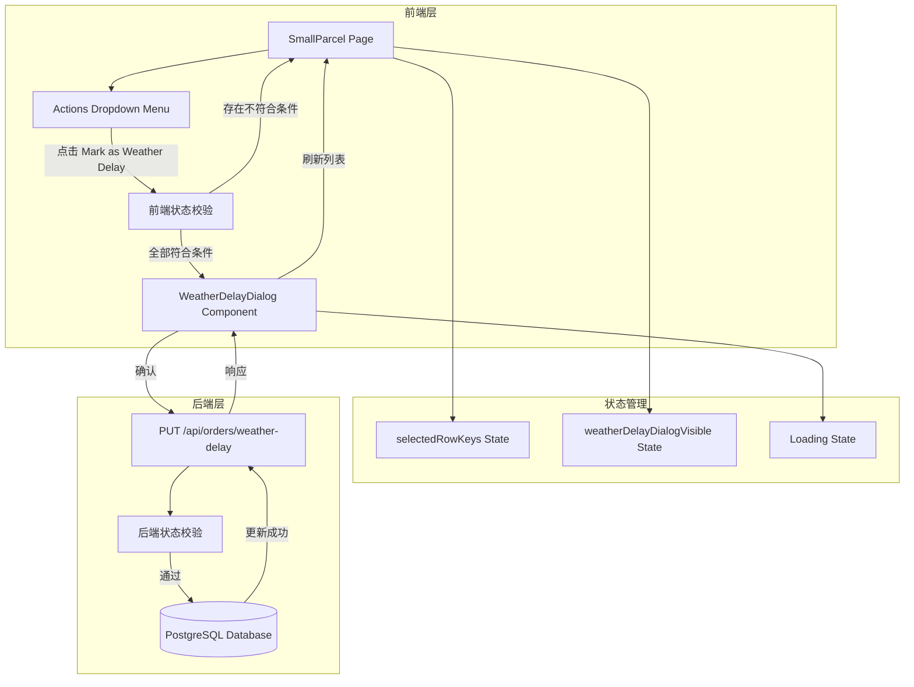
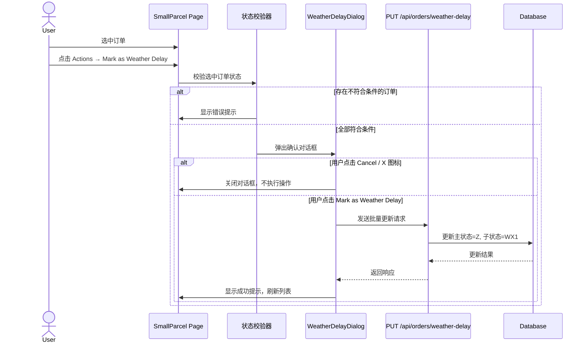

# 设计文档: Weather Delay 标记功能

## Overview

本设计文档描述了 OMS Small Parcel 页面的 "Mark as Weather Delay" 功能的技术实现方案。该功能允许用户在 Small Parcel 列表页面的 Actions 下拉菜单中，将符合条件的订单标记为 Weather Delay 状态。

系统采用前后端分离架构：
- **前端**: React + Ant Design + Redux（与现有技术栈一致）
- **后端**: Express + Node.js

核心功能包括：
1. Actions 下拉菜单中新增 "Mark as Weather Delay" 选项（位于 "Mark as IQA" 下方）
2. 订单状态条件校验（排除终结状态和 Created 状态）
3. 确认对话框（WeatherDelayDialog，参考 RTSDialog 组件模式）
4. 后端 API 更新订单主状态为 Delay Exception（Z），子状态为 Weather Delay（Scancode=WX1）
5. 支持单个和批量标记

### 设计决策

1. **复用 RTSDialog 组件模式**: WeatherDelayDialog 参考现有 RTSDialog 的 Modal 结构、样式类名和关闭交互模式，保持 UI 一致性。
2. **前端先校验**: 在弹出确认对话框前，前端先校验选中订单状态，减少无效 API 请求。
3. **后端双重校验**: 后端 API 也执行状态校验，防止并发操作导致的数据不一致。
4. **批量操作原子性**: 如果批量请求中包含不符合条件的订单，整个请求被拒绝，避免部分更新。

## Architecture

### 系统架构图



### 交互流程图



## Components and Interfaces

### 前端组件

#### 1. SmallParcel 页面修改

在现有 `SmallParcel/index.tsx` 的 Actions 下拉菜单中，在 "Mark as IQA" 下方新增 "Mark as Weather Delay" 选项。

```typescript
// Actions 菜单项更新
const menuItems = [
  { key: 'discarded', label: 'Mark as Discarded' },
  { key: 'lost', label: 'Mark as Lost' },
  { key: 'iqa', label: 'Mark as IQA' },
  { key: 'weatherDelay', label: 'Mark as Weather Delay', disabled: selectedRowKeys.length === 0 },
  { key: 'return', label: 'Return to Shipper', disabled: selectedRowKeys.length === 0 },
  { key: 'delivered', label: 'Mark as Delivered' },
];
```

新增状态和处理函数：

```typescript
const [weatherDelayDialogVisible, setWeatherDelayDialogVisible] = useState(false);

// 不可操作的状态集合
const INELIGIBLE_STATUSES = ['Delivered', 'Discarded', 'Lost', 'Return to Sender', 'Created'];

const handleMenuClick = ({ key }: { key: string }) => {
  if (key === 'weatherDelay') {
    const hasIneligible = selectedOrders.some(
      order => INELIGIBLE_STATUSES.includes(order.status)
    );
    if (hasIneligible) {
      message.warning("One or more of the selected orders cannot be marked as 'Weather Delay' due to their current status.");
      return;
    }
    setWeatherDelayDialogVisible(true);
  }
};
```

#### 2. WeatherDelayDialog 组件

新建 `frontend/src/components/WeatherDelay/WeatherDelayDialog.tsx`，参考 RTSDialog 的 Modal 模式。

```typescript
interface WeatherDelayDialogProps {
  visible: boolean;
  selectedOrders: { airbillNo: string; status: string }[];
  onCancel: () => void;
  onConfirm: () => void;
  loading: boolean;
}

const WeatherDelayDialog: React.FC<WeatherDelayDialogProps> = ({
  visible,
  selectedOrders,
  onCancel,
  onConfirm,
  loading,
}) => {
  return (
    <Modal
      title={
        <div style={{ display: 'flex', justifyContent: 'space-between', alignItems: 'center' }}>
          <span>Mark as Weather Delay</span>
          <CloseOutlined onClick={onCancel} style={{ cursor: 'pointer' }} />
        </div>
      }
      open={visible}
      onCancel={onCancel}
      closeIcon={null}
      footer={
        <div style={{ display: 'flex', justifyContent: 'flex-end', gap: '12px' }}>
          <Button onClick={onCancel}>Cancel</Button>
          <Button type="primary" onClick={onConfirm} loading={loading}>
            Mark as Weather Delay
          </Button>
        </div>
      }
      className="weather-delay-dialog"
    >
      <p>Are you sure you want to set the order status to Weather Delay?</p>
      <p>{selectedOrders.length} order(s) selected.</p>
    </Modal>
  );
};
```

#### 3. WeatherDelayDialog 样式

新建 `frontend/src/components/WeatherDelay/WeatherDelayDialog.css`，复用 RTSDialog 的样式模式。

### 后端 API

#### PUT /api/orders/weather-delay

```typescript
// 请求体
interface WeatherDelayRequest {
  airbillNos: string[];  // 要标记的订单运单号列表
}

// 成功响应 (200)
interface WeatherDelaySuccessResponse {
  success: true;
  data: {
    updatedCount: number;
    orders: Array<{
      airbillNo: string;
      status: string;       // "Delay Exception"
      statusCode: string;   // "Z"
      subStatus: string;    // "Weather Delay"
      scanCode: string;     // "WX1"
    }>;
  };
}

// 错误响应 - 包含不符合条件的订单 (400)
interface WeatherDelayErrorResponse {
  success: false;
  error: {
    code: string;           // "INELIGIBLE_ORDERS"
    message: string;
    ineligibleOrders: Array<{
      airbillNo: string;
      currentStatus: string;
    }>;
  };
}
```

#### Express 路由实现

```typescript
app.put('/api/orders/weather-delay', async (req, res) => {
  try {
    const { airbillNos } = req.body;

    if (!airbillNos || !Array.isArray(airbillNos) || airbillNos.length === 0) {
      return res.status(400).json({
        success: false,
        error: { code: 'INVALID_REQUEST', message: 'airbillNos array is required' }
      });
    }

    // 查询订单当前状态
    const orders = await db.query(
      'SELECT airbill_no, status FROM orders WHERE airbill_no = ANY($1)',
      [airbillNos]
    );

    // 校验状态
    const ineligible = orders.rows.filter(o =>
      INELIGIBLE_STATUSES.includes(o.status)
    );

    if (ineligible.length > 0) {
      return res.status(400).json({
        success: false,
        error: {
          code: 'INELIGIBLE_ORDERS',
          message: "One or more of the selected orders cannot be marked as 'Weather Delay' due to their current status.",
          ineligibleOrders: ineligible.map(o => ({
            airbillNo: o.airbill_no,
            currentStatus: o.status
          }))
        }
      });
    }

    // 更新状态
    await db.query(
      `UPDATE orders SET status = 'Delay Exception',
       status_code = 'Z', sub_status = 'Weather Delay',
       scan_code = 'WX1', updated_at = NOW()
       WHERE airbill_no = ANY($1)`,
      [airbillNos]
    );

    res.json({
      success: true,
      data: {
        updatedCount: airbillNos.length,
        orders: airbillNos.map(no => ({
          airbillNo: no,
          status: 'Delay Exception',
          statusCode: 'Z',
          subStatus: 'Weather Delay',
          scanCode: 'WX1'
        }))
      }
    });
  } catch (error) {
    res.status(500).json({
      success: false,
      error: { code: 'INTERNAL_ERROR', message: 'Internal server error' }
    });
  }
});
```

### 状态校验函数

前端和后端共用的校验逻辑：

```typescript
// 不可操作的状态列表
const INELIGIBLE_STATUSES = [
  'Delivered',   // D
  'Discarded',   // T
  'Lost',        // L
  'Return to Sender', // S
  'Created',     // 初始创建状态
];

/**
 * 校验订单是否符合 Weather Delay 标记条件
 * @param status 订单当前状态
 * @returns true 表示符合条件，false 表示不符合
 */
function isEligibleForWeatherDelay(status: string): boolean {
  return !INELIGIBLE_STATUSES.includes(status);
}

/**
 * 批量校验订单
 * @param orders 订单列表
 * @returns 不符合条件的订单列表
 */
function findIneligibleOrders(orders: { airbillNo: string; status: string }[]): typeof orders {
  return orders.filter(order => !isEligibleForWeatherDelay(order.status));
}
```

## Data Models

### 数据库变更

需要在 `orders` 表中新增字段以支持状态码和子状态：

```sql
-- 新增状态码和子状态字段
ALTER TABLE orders ADD COLUMN IF NOT EXISTS status_code VARCHAR(10);
ALTER TABLE orders ADD COLUMN IF NOT EXISTS sub_status VARCHAR(100);
ALTER TABLE orders ADD COLUMN IF NOT EXISTS scan_code VARCHAR(20);

-- 为新字段创建索引
CREATE INDEX IF NOT EXISTS idx_orders_status_code ON orders (status_code);
CREATE INDEX IF NOT EXISTS idx_orders_scan_code ON orders (scan_code);
```

### 状态映射

| 主状态 | 状态码 | 子状态 | Scancode | 说明 |
|--------|--------|--------|----------|------|
| Delay Exception | Z | Weather Delay | WX1 | 天气延迟 |
| Delivered | D | - | - | 已送达（终结状态） |
| Discarded | T | - | - | 已丢弃（终结状态） |
| Lost | L | - | - | 已丢失（终结状态） |
| Return to Sender | S | - | - | 退回发件人（终结状态） |
| Created | - | - | - | 初始创建（不可操作） |

### 前端类型扩展

```typescript
// 在 frontend/src/types/order.ts 中扩展
export interface OrderStatusDetail {
  status: string;
  statusCode?: string;
  subStatus?: string;
  scanCode?: string;
}

// Weather Delay 相关常量
export const WEATHER_DELAY_STATUS = {
  status: 'Delay Exception',
  statusCode: 'Z',
  subStatus: 'Weather Delay',
  scanCode: 'WX1',
} as const;

export const INELIGIBLE_STATUSES_FOR_WEATHER_DELAY = [
  'Delivered',
  'Discarded',
  'Lost',
  'Return to Sender',
  'Created',
] as const;
```

## Correctness Properties

*属性（Property）是关于系统行为的特征或规则，应该在所有有效执行中保持为真。属性是人类可读规范和机器可验证正确性保证之间的桥梁。*

### Property 1: 菜单项禁用状态与选中数量的关系

*For any* 选中订单数量 n，"Mark as Weather Delay" 菜单项的 disabled 状态应等于 (n === 0)。即：无选中时禁用，有选中时启用。

**Validates: Requirements 1.2, 1.3**

### Property 2: Detail 页面按钮可见性与订单状态的关系

*For any* 订单状态 status，"Mark as Weather Delay" 按钮的可见性应等于 `!INELIGIBLE_STATUSES.includes(status)`。即：处于 Delivered、Discarded、Lost、Return to Sender、Created 状态时隐藏，其他状态时显示。

**Validates: Requirements 2.1, 2.2**

### Property 3: 订单状态资格校验函数正确性

*For any* 订单状态字符串 status，`isEligibleForWeatherDelay(status)` 应当且仅当 status 不在 ['Delivered', 'Discarded', 'Lost', 'Return to Sender', 'Created'] 集合中时返回 true。

**Validates: Requirements 3.2, 3.3, 3.4, 3.5, 3.6**

### Property 4: 确认对话框弹出条件

*For any* 选中订单集合，确认对话框应当且仅当所有选中订单均通过 `isEligibleForWeatherDelay` 校验时弹出。若存在任何不符合条件的订单，应显示错误提示而非弹出对话框。

**Validates: Requirements 3.7, 3.8**

### Property 5: 取消/关闭操作不产生副作用

*For any* 已打开的确认对话框状态，无论通过 "Cancel" 按钮还是右上角 X 图标关闭，对话框都应关闭且不触发任何 API 调用，订单状态保持不变。

**Validates: Requirements 4.4, 4.5**

### Property 6: 确认操作触发 API 调用

*For any* 已打开的确认对话框和非空的合格订单集合，点击 "Mark as Weather Delay" 确认按钮应触发向 `PUT /api/orders/weather-delay` 端点的请求，请求体包含所有选中订单的 airbillNo。

**Validates: Requirements 4.6, 5.1**

### Property 7: 成功更新后状态字段正确性

*For any* 成功的 Weather Delay 标记操作，更新后的订单应满足：主状态 = "Delay Exception"，状态码 = "Z"，子状态 = "Weather Delay"，Scancode = "WX1"。

**Validates: Requirements 5.2, 5.3**

### Property 8: API 错误时订单状态不变

*For any* 失败的 API 请求，所有相关订单的状态应保持其调用前的原始值不变。

**Validates: Requirements 5.6**

### Property 9: 后端拒绝包含不合格订单的请求

*For any* 包含至少一个不合格订单（状态为 Delivered、Discarded、Lost、Return to Sender 或 Created）的请求，后端应返回错误响应（HTTP 400），且响应体中应列出所有不符合条件的订单及其当前状态。

**Validates: Requirements 7.2, 7.4**

## Error Handling

### 前端错误处理

#### 1. 状态校验错误

```typescript
// 在点击菜单项时进行前端校验
const handleWeatherDelayClick = () => {
  const ineligible = findIneligibleOrders(selectedOrders);
  if (ineligible.length > 0) {
    message.warning(
      "One or more of the selected orders cannot be marked as 'Weather Delay' due to their current status."
    );
    return;
  }
  setWeatherDelayDialogVisible(true);
};
```

#### 2. API 调用错误

```typescript
const handleConfirmWeatherDelay = async () => {
  setLoading(true);
  try {
    const response = await fetch('/api/orders/weather-delay', {
      method: 'PUT',
      headers: { 'Content-Type': 'application/json' },
      body: JSON.stringify({
        airbillNos: selectedOrders.map(o => o.airbillNo)
      }),
    });

    if (!response.ok) {
      const error = await response.json();
      throw new Error(error.error?.message || 'Failed to mark as Weather Delay');
    }

    const result = await response.json();
    message.success(`Successfully marked ${result.data.updatedCount} order(s) as Weather Delay`);
    setWeatherDelayDialogVisible(false);
    setSelectedRowKeys([]);
    // 刷新订单列表
    refreshOrders();
  } catch (error) {
    message.error(error instanceof Error ? error.message : 'An unexpected error occurred');
  } finally {
    setLoading(false);
  }
};
```

#### 3. 网络错误

当网络不可用时，fetch 会抛出 TypeError，由上述 catch 块统一处理，向用户显示友好的错误提示。

### 后端错误处理

#### 1. 请求验证错误

```typescript
// 缺少必要参数
if (!airbillNos || !Array.isArray(airbillNos) || airbillNos.length === 0) {
  return res.status(400).json({
    success: false,
    error: { code: 'INVALID_REQUEST', message: 'airbillNos array is required and must not be empty' }
  });
}
```

#### 2. 订单不存在

```typescript
const foundOrders = await db.query(...);
const notFound = airbillNos.filter(
  no => !foundOrders.rows.some(o => o.airbill_no === no)
);
if (notFound.length > 0) {
  return res.status(404).json({
    success: false,
    error: { code: 'ORDERS_NOT_FOUND', message: `Orders not found: ${notFound.join(', ')}` }
  });
}
```

#### 3. 数据库错误

```typescript
try {
  await db.query('BEGIN');
  await db.query(updateSQL, [airbillNos]);
  await db.query('COMMIT');
} catch (dbError) {
  await db.query('ROLLBACK');
  return res.status(500).json({
    success: false,
    error: { code: 'DB_ERROR', message: 'Failed to update order status' }
  });
}
```

### 错误恢复策略

1. **前端校验优先**: 减少无效 API 请求，提升用户体验
2. **后端事务保护**: 使用数据库事务确保批量更新的原子性
3. **状态回滚**: API 失败时前端不更新本地状态，保持数据一致性
4. **用户反馈**: 所有错误场景都向用户显示清晰的提示信息

## Testing Strategy

### 测试方法

本项目采用双重测试策略，结合单元测试和基于属性的测试（Property-Based Testing, PBT）：

- **单元测试**: 验证特定示例、边缘情况和错误条件
- **属性测试**: 验证跨所有输入的通用属性

两者互补，共同提供全面的测试覆盖。

### 测试框架

- **前端测试框架**: Vitest（项目已配置）
- **React 组件测试**: React Testing Library
- **属性测试库**: fast-check
- **后端测试框架**: Vitest
- **API 测试**: Supertest

### 属性测试配置

每个属性测试必须：
1. 运行至少 100 次迭代
2. 使用注释标签引用设计文档中的属性
3. 标签格式：`Feature: weather-delay-marking, Property {number}: {property_text}`
4. 每个正确性属性由一个单独的属性测试实现

### 单元测试覆盖

#### 前端单元测试

**SmallParcel 页面**
- Actions 菜单中 "Mark as Weather Delay" 位于 "Mark as IQA" 下方
- 无选中订单时菜单项禁用
- 选中订单后菜单项启用
- 点击后触发状态校验

**WeatherDelayDialog 组件**
- 对话框正确渲染确认文案
- Cancel 按钮关闭对话框
- X 图标关闭对话框
- 确认按钮触发 API 调用
- loading 状态下按钮显示加载指示器

**状态校验函数**
- Delivered 状态返回不合格
- Created 状态返回不合格
- "Possession Scan at Terminal" 状态返回合格
- "Out For Delivery" 状态返回合格
- 空字符串状态的边缘情况

#### 后端单元测试

**PUT /api/orders/weather-delay 端点**
- 成功更新单个订单
- 成功批量更新多个订单
- 缺少 airbillNos 参数返回 400
- 空数组返回 400
- 包含不合格订单返回 400 并列出详情
- 订单不存在返回 404
- 数据库错误返回 500

### 属性测试覆盖

```typescript
import fc from 'fast-check';

// 测试数据生成器
const eligibleStatusArb = fc.constantFrom(
  'Possession Scan at Terminal',
  'Out For Delivery',
  'Inbound scan at destination',
  'In Transit',
  'Picked Up'
);

const ineligibleStatusArb = fc.constantFrom(
  'Delivered',
  'Discarded',
  'Lost',
  'Return to Sender',
  'Created'
);

const orderArb = fc.record({
  airbillNo: fc.stringMatching(/^[A-Z0-9]{8}$/),
  status: fc.oneof(eligibleStatusArb, ineligibleStatusArb),
});
```

**Property 1: 菜单项禁用状态**
```typescript
// Feature: weather-delay-marking, Property 1: 菜单项禁用状态与选中数量的关系
fc.assert(fc.property(
  fc.integer({ min: 0, max: 100 }),
  (selectedCount) => {
    const disabled = selectedCount === 0;
    // 验证菜单项 disabled 状态
    return menuItemDisabled === disabled;
  }
), { numRuns: 100 });
```

**Property 3: 订单状态资格校验函数正确性**
```typescript
// Feature: weather-delay-marking, Property 3: 订单状态资格校验函数正确性
fc.assert(fc.property(
  fc.oneof(eligibleStatusArb, ineligibleStatusArb),
  (status) => {
    const result = isEligibleForWeatherDelay(status);
    const expected = !INELIGIBLE_STATUSES.includes(status);
    return result === expected;
  }
), { numRuns: 100 });
```

**Property 4: 确认对话框弹出条件**
```typescript
// Feature: weather-delay-marking, Property 4: 确认对话框弹出条件
fc.assert(fc.property(
  fc.array(orderArb, { minLength: 1, maxLength: 20 }),
  (orders) => {
    const allEligible = orders.every(o => isEligibleForWeatherDelay(o.status));
    // 验证：全部合格时弹出对话框，否则显示错误
    return dialogOpened === allEligible;
  }
), { numRuns: 100 });
```

**Property 7: 成功更新后状态字段正确性**
```typescript
// Feature: weather-delay-marking, Property 7: 成功更新后状态字段正确性
fc.assert(fc.property(
  fc.array(fc.stringMatching(/^[A-Z0-9]{8}$/), { minLength: 1, maxLength: 10 }),
  async (airbillNos) => {
    const response = await markAsWeatherDelay(airbillNos);
    return response.data.orders.every(o =>
      o.status === 'Delay Exception' &&
      o.statusCode === 'Z' &&
      o.subStatus === 'Weather Delay' &&
      o.scanCode === 'WX1'
    );
  }
), { numRuns: 100 });
```

**Property 9: 后端拒绝包含不合格订单的请求**
```typescript
// Feature: weather-delay-marking, Property 9: 后端拒绝包含不合格订单的请求
fc.assert(fc.property(
  fc.array(orderArb, { minLength: 1, maxLength: 10 }).filter(
    orders => orders.some(o => !isEligibleForWeatherDelay(o.status))
  ),
  async (orders) => {
    const response = await request(app)
      .put('/api/orders/weather-delay')
      .send({ airbillNos: orders.map(o => o.airbillNo) });
    return response.status === 400 &&
      response.body.error.ineligibleOrders.length > 0;
  }
), { numRuns: 100 });
```

### 测试执行

```bash
# 运行前端测试
cd frontend && npx vitest --run

# 运行后端测试
cd backend && npx vitest --run

# 仅运行属性测试
cd frontend && npx vitest --run --testNamePattern="Property"
```
