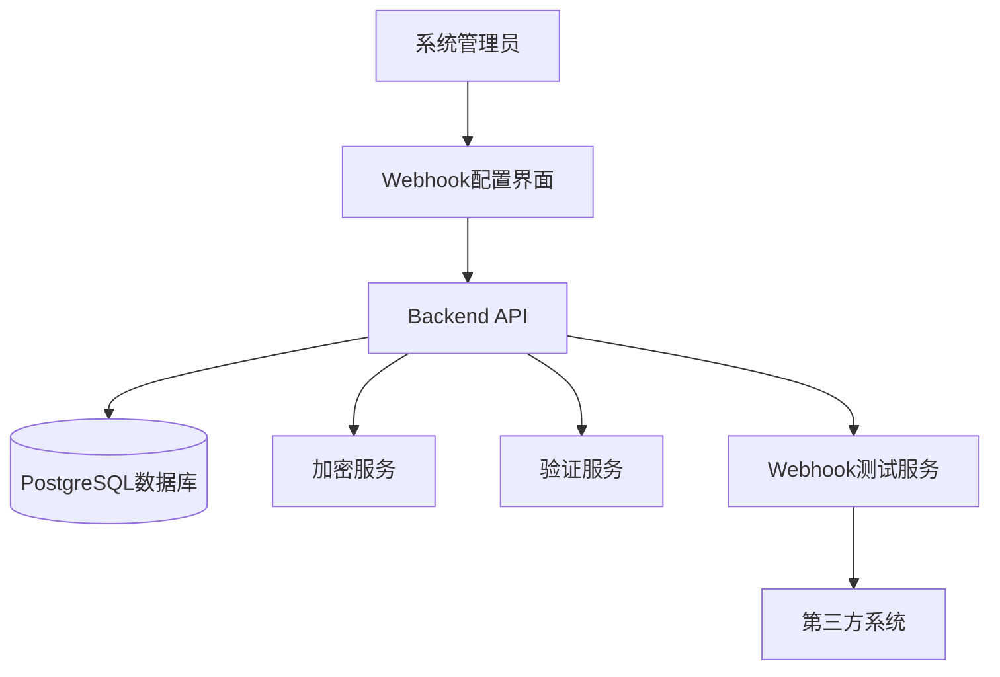

# Design Document: Webhook Integration Enhancement

## Overview

本设计文档描述了OMS系统Webhook集成增强功能的技术实现方案。该功能将改进现有的Webhook配置页面，使其能够支持多种复杂的第三方系统集成场景。

### Goals

1. 提供灵活的Webhook配置界面，支持多种认证方式和传输协议
2. 支持LMS、HelloFresh、Uber、Triaga等特定集成场景的预设模板
3. 实现环境切换功能，支持Dev、Staging、Prod环境配置
4. 提供自定义字段映射功能，满足不同第三方系统的数据格式要求
5. 确保配置数据的安全存储和传输
6. 提供友好的用户体验，包括表单验证、错误提示和测试功能

### Non-Goals

1. 不实现Webhook执行引擎的核心逻辑（假设已存在）
2. 不实现实时监控和日志查看功能（可作为未来增强）
3. 不实现Webhook配置的版本控制功能
4. 不实现批量导入/导出配置功能

## Architecture

### System Context



### Component Architecture

系统采用分层架构设计：

1. **Presentation Layer（展示层）**
   - WebhookConfigForm: 主配置表单组件
   - TemplateSelector: 模板选择组件
   - AuthenticationConfig: 认证配置组件
   - TransportConfig: 传输协议配置组件
   - FieldMappingConfig: 字段映射配置组件

2. **Business Logic Layer（业务逻辑层）**
   - WebhookConfigService: Webhook配置管理服务
   - ValidationService: 表单验证服务
   - TemplateService: 模板管理服务
   - TestService: Webhook测试服务

3. **Data Access Layer（数据访问层）**
   - WebhookConfigRepository: 配置数据访问
   - EncryptionService: 敏感数据加密/解密


## Components and Interfaces

### Frontend Components

#### 1. WebhookConfigForm

主配置表单组件，负责整体表单布局和状态管理。

```typescript
interface WebhookConfigFormProps {
  mode: 'create' | 'edit';
  initialValues?: WebhookConfig;
  onSave: (config: WebhookConfig) => Promise<void>;
  onCancel: () => void;
}

interface WebhookConfigFormState {
  config: WebhookConfig;
  errors: ValidationErrors;
  isSubmitting: boolean;
  isTesting: boolean;
}
```

**职责：**
- 管理表单整体状态
- 协调子组件交互
- 处理表单提交和取消操作
- 触发表单验证

#### 2. TemplateSelector

模板选择组件，提供预设模板快速配置功能。

```typescript
interface TemplateSelectorProps {
  value: TemplateType;
  onChange: (template: TemplateType, config: Partial<WebhookConfig>) => void;
}

type TemplateType = 'custom' | 'lms' | 'hellofresh' | 'uber' | 'triaga';

interface TemplateDefinition {
  name: string;
  description: string;
  defaultConfig: Partial<WebhookConfig>;
}
```

**职责：**
- 显示可用模板列表
- 提供模板描述和说明
- 应用模板默认配置

#### 3. AuthenticationConfig

认证配置组件，根据选择的认证方式显示相应的配置字段。

```typescript
interface AuthenticationConfigProps {
  authMethod: AuthMethod;
  credentials: AuthCredentials;
  onChange: (credentials: AuthCredentials) => void;
  errors?: ValidationErrors;
}

type AuthMethod = 'none' | 'basic' | 'bearer' | 'apikey' | 'oauth2' | 'jwt';

interface AuthCredentials {
  basic?: {
    username: string;
    password: string;
  };
  bearer?: {
    token: string;
  };
  apikey?: {
    key: string;
    headerName: string;
  };
  oauth2?: {
    clientId: string;
    clientSecret: string;
    tokenUrl: string;
  };
  jwt?: {
    token: string;
  };
}
```

**职责：**
- 根据认证方式动态显示配置字段
- 验证认证凭据格式
- 提供密码/密钥的安全输入


#### 4. TransportConfig

传输协议配置组件，支持HTTP/HTTPS Webhook和SFTP配置。

```typescript
interface TransportConfigProps {
  protocol: TransportProtocol;
  config: TransportConfiguration;
  onChange: (config: TransportConfiguration) => void;
  errors?: ValidationErrors;
}

type TransportProtocol = 'http' | 'https' | 'sftp';

interface TransportConfiguration {
  http?: {
    url: string;
    method: 'GET' | 'POST' | 'PUT' | 'PATCH';
    headers?: Record<string, string>;
    timeout?: number;
  };
  sftp?: {
    host: string;
    port: number;
    username: string;
    password?: string;
    privateKey?: string;
    directory: string;
  };
}
```

**职责：**
- 根据协议类型显示相应配置字段
- 验证URL格式和SFTP连接参数
- 提供自定义HTTP头部配置

#### 5. FieldMappingConfig

字段映射配置组件，允许自定义字段映射规则。

```typescript
interface FieldMappingConfigProps {
  mappings: FieldMapping[];
  onChange: (mappings: FieldMapping[]) => void;
}

interface FieldMapping {
  sourceField: string;
  targetField: string;
  transform?: TransformFunction;
}

type TransformFunction = 'none' | 'uppercase' | 'lowercase' | 'base64' | 'custom';
```

**职责：**
- 显示字段映射列表
- 允许添加/删除/编辑映射规则
- 提供字段转换函数选择

### Backend API Endpoints

#### 1. Webhook Configuration Management

```typescript
// 创建Webhook配置
POST /api/webhooks
Request Body: {
  ruleName: string;
  businessType: string;
  warehouse?: string;
  eventType: string;
  environment: 'dev' | 'staging' | 'prod';
  transport: TransportConfiguration;
  authentication: AuthCredentials;
  fieldMappings: FieldMapping[];
  customerCodes?: string[];
  retryConfig?: RetryConfiguration;
  status: boolean;
}
Response: {
  success: boolean;
  data: { id: string; config: WebhookConfig };
}

// 更新Webhook配置
PUT /api/webhooks/:id
Request Body: WebhookConfig
Response: {
  success: boolean;
  data: { config: WebhookConfig };
}

// 获取Webhook配置
GET /api/webhooks/:id
Response: {
  success: boolean;
  data: { config: WebhookConfig };
}

// 删除Webhook配置
DELETE /api/webhooks/:id
Response: {
  success: boolean;
}

// 测试Webhook配置
POST /api/webhooks/test
Request Body: {
  config: WebhookConfig;
  testPayload?: any;
}
Response: {
  success: boolean;
  data: {
    statusCode: number;
    responseBody: any;
    latency: number;
  };
  error?: string;
}
```


## Data Models

### WebhookConfig

完整的Webhook配置数据模型。

```typescript
interface WebhookConfig {
  id?: string;
  ruleName: string;
  businessType: 'PO' | 'SO' | 'Freight' | 'Inventory' | 'Product' | 'Others';
  warehouse?: string;
  eventType: EventType;
  environment: Environment;
  template?: TemplateType;
  
  // 传输配置
  protocol: TransportProtocol;
  transport: TransportConfiguration;
  
  // 认证配置
  authMethod: AuthMethod;
  authentication: AuthCredentials;
  
  // 字段映射
  fieldMappings: FieldMapping[];
  trackingNumberSource: 'airbillno' | 'billingref';
  
  // 过滤条件
  customerCodes?: string[];
  
  // 重试配置
  retryConfig: RetryConfiguration;
  
  // 元数据
  status: boolean;
  remark?: string;
  createdAt?: string;
  updatedAt?: string;
  createdBy?: string;
  updatedBy?: string;
}

type EventType = 
  | 'order_created'
  | 'order_updated'
  | 'order_shipped'
  | 'order_delivered'
  | 'order_cancelled'
  | 'tracking_updated'
  | 'status_changed';

type Environment = 'dev' | 'staging' | 'prod';

interface RetryConfiguration {
  enabled: boolean;
  maxRetries: number;
  retryInterval: number; // seconds
  backoffMultiplier?: number;
}
```

### Template Definitions

预设模板的配置定义。

```typescript
const TEMPLATE_DEFINITIONS: Record<TemplateType, TemplateDefinition> = {
  lms: {
    name: 'LMS Integration',
    description: 'Last Mile Solutions integration with Basic Auth',
    defaultConfig: {
      protocol: 'https',
      authMethod: 'basic',
      authentication: {
        basic: {
          username: 'ops@gros1ale.com',
          password: 'DSGFP9LxW4DVa'
        }
      },
      trackingNumberSource: 'billingref',
      transport: {
        http: {
          method: 'POST',
          timeout: 30000
        }
      }
    }
  },
  hellofresh: {
    name: 'HelloFresh Integration',
    description: 'HelloFresh SFTP integration for Project44',
    defaultConfig: {
      protocol: 'sftp',
      transport: {
        sftp: {
          host: 'ftp.getcenviy.com',
          port: 22,
          username: 'll',
          directory: '/upload/tilloaeesh/updates'
        }
      },
      customerCodes: ['518276', '518278', '518275', '518277']
    }
  },
  uber: {
    name: 'Uber Integration',
    description: 'Uber package-tracking API integration',
    defaultConfig: {
      protocol: 'https',
      authMethod: 'bearer',
      fieldMappings: [
        {
          sourceField: 'photoUrl',
          targetField: 'delivery_verification.photo_url',
          transform: 'none'
        },
        {
          sourceField: 'signatureUrl',
          targetField: 'delivery_verification.signature_url',
          transform: 'none'
        }
      ]
    }
  },
  triaga: {
    name: 'Triaga Integration',
    description: 'Triaga event integration with API Key',
    defaultConfig: {
      protocol: 'https',
      authMethod: 'apikey',
      authentication: {
        apikey: {
          headerName: 'x-api-key',
          key: ''
        }
      },
      customerCodes: ['618341']
    }
  },
  custom: {
    name: 'Custom Configuration',
    description: 'Start with a blank configuration',
    defaultConfig: {}
  }
};
```


### Database Schema

```sql
-- Webhook配置表
CREATE TABLE webhook_configs (
  id UUID PRIMARY KEY DEFAULT gen_random_uuid(),
  rule_name VARCHAR(255) NOT NULL,
  business_type VARCHAR(50) NOT NULL,
  warehouse VARCHAR(100),
  event_type VARCHAR(100) NOT NULL,
  environment VARCHAR(20) NOT NULL,
  template VARCHAR(50),
  
  -- 传输配置
  protocol VARCHAR(20) NOT NULL,
  transport_config JSONB NOT NULL,
  
  -- 认证配置
  auth_method VARCHAR(50) NOT NULL,
  auth_credentials_encrypted TEXT,
  
  -- 字段映射
  field_mappings JSONB,
  tracking_number_source VARCHAR(20),
  
  -- 过滤条件
  customer_codes TEXT[],
  
  -- 重试配置
  retry_config JSONB,
  
  -- 元数据
  status BOOLEAN DEFAULT true,
  remark TEXT,
  created_at TIMESTAMP DEFAULT CURRENT_TIMESTAMP,
  updated_at TIMESTAMP DEFAULT CURRENT_TIMESTAMP,
  created_by VARCHAR(255),
  updated_by VARCHAR(255),
  
  -- 索引
  CONSTRAINT unique_rule_name_env UNIQUE (rule_name, environment)
);

CREATE INDEX idx_webhook_business_type ON webhook_configs(business_type);
CREATE INDEX idx_webhook_event_type ON webhook_configs(event_type);
CREATE INDEX idx_webhook_environment ON webhook_configs(environment);
CREATE INDEX idx_webhook_status ON webhook_configs(status);

-- 审计日志表
CREATE TABLE webhook_config_audit (
  id UUID PRIMARY KEY DEFAULT gen_random_uuid(),
  webhook_config_id UUID REFERENCES webhook_configs(id),
  action VARCHAR(50) NOT NULL, -- 'create', 'update', 'delete'
  changes JSONB,
  performed_by VARCHAR(255),
  performed_at TIMESTAMP DEFAULT CURRENT_TIMESTAMP
);

CREATE INDEX idx_audit_webhook_id ON webhook_config_audit(webhook_config_id);
CREATE INDEX idx_audit_performed_at ON webhook_config_audit(performed_at);
```

### Validation Rules

表单验证规则定义。

```typescript
interface ValidationRule {
  field: string;
  rules: Array<{
    type: 'required' | 'pattern' | 'custom';
    message: string;
    validator?: (value: any, config: WebhookConfig) => boolean;
  }>;
}

const VALIDATION_RULES: ValidationRule[] = [
  {
    field: 'ruleName',
    rules: [
      { type: 'required', message: 'Rule name is required' },
      { 
        type: 'pattern', 
        message: 'Rule name must be alphanumeric with underscores/hyphens',
        validator: (value) => /^[a-zA-Z0-9_-]+$/.test(value)
      }
    ]
  },
  {
    field: 'eventType',
    rules: [
      { type: 'required', message: 'Event type is required' }
    ]
  },
  {
    field: 'transport.http.url',
    rules: [
      {
        type: 'custom',
        message: 'Valid URL is required for HTTP/HTTPS protocol',
        validator: (value, config) => {
          if (config.protocol === 'http' || config.protocol === 'https') {
            return /^https?:\/\/.+/.test(value);
          }
          return true;
        }
      }
    ]
  },
  {
    field: 'transport.sftp.host',
    rules: [
      {
        type: 'custom',
        message: 'SFTP host is required',
        validator: (value, config) => {
          if (config.protocol === 'sftp') {
            return !!value && value.length > 0;
          }
          return true;
        }
      }
    ]
  },
  {
    field: 'transport.sftp.port',
    rules: [
      {
        type: 'custom',
        message: 'SFTP port must be between 1 and 65535',
        validator: (value, config) => {
          if (config.protocol === 'sftp') {
            const port = parseInt(value);
            return !isNaN(port) && port >= 1 && port <= 65535;
          }
          return true;
        }
      }
    ]
  },
  {
    field: 'authentication.basic',
    rules: [
      {
        type: 'custom',
        message: 'Username and password are required for Basic Auth',
        validator: (value, config) => {
          if (config.authMethod === 'basic') {
            return !!value?.username && !!value?.password;
          }
          return true;
        }
      }
    ]
  },
  {
    field: 'authentication.apikey',
    rules: [
      {
        type: 'custom',
        message: 'API key and header name are required',
        validator: (value, config) => {
          if (config.authMethod === 'apikey') {
            return !!value?.key && !!value?.headerName;
          }
          return true;
        }
      }
    ]
  }
];
```


## Correctness Properties

*属性（Property）是系统在所有有效执行中都应该保持为真的特征或行为——本质上是关于系统应该做什么的形式化陈述。属性作为人类可读规范和机器可验证正确性保证之间的桥梁。*

### Property 1: 认证方式字段显示一致性

*对于任何*认证方式选择，当该认证方式被选中时，配置表单应该显示该认证方式所需的所有必填字段，并且这些字段应该是可编辑的。

**Validates: Requirements 1.2, 1.4, 1.5**

### Property 2: 传输协议字段显示互斥性

*对于任何*传输协议选择，当该协议被选中时，配置表单应该显示该协议所需的字段，并隐藏其他协议特定的字段。

**Validates: Requirements 2.2, 2.3, 2.4**

### Property 3: Basic Auth凭据Base64编码

*对于任何*Basic Auth用户名和密码组合，当保存配置时，存储的凭据应该是原始凭据的Base64编码形式。

**Validates: Requirements 1.3**

### Property 4: SFTP连接参数验证

*对于任何*SFTP配置，当协议为SFTP时，系统应该验证主机名非空、端口在1-65535范围内、用户名非空、目录路径非空。

**Validates: Requirements 2.5, 10.4**

### Property 5: 环境配置隔离

*对于任何*Webhook配置，当为不同环境（Dev/Staging/Prod）保存配置时，每个环境的配置应该独立存储，修改一个环境的配置不应影响其他环境。

**Validates: Requirements 3.3**

### Property 6: 字段映射CRUD操作

*对于任何*字段映射列表，用户应该能够添加新映射、编辑现有映射、删除映射，并且这些操作应该正确反映在配置数据中。

**Validates: Requirements 4.4**

### Property 7: 客户代码格式验证

*对于任何*客户代码输入，系统应该验证每个代码（逗号分隔）都符合预期格式（数字或字母数字），并在格式无效时显示错误。

**Validates: Requirements 5.4**

### Property 8: 必填字段验证

*对于任何*配置表单提交，当任何必填字段为空时，系统应该阻止提交并显示相应的错误消息。

**Validates: Requirements 10.1, 10.3**

### Property 9: URL格式验证

*对于任何*URL输入字段，当输入的值不符合有效URL格式（http://或https://开头）时，系统应该显示格式错误消息。

**Validates: Requirements 10.2**

### Property 10: 验证错误时禁用保存

*对于任何*配置表单状态，当存在任何验证错误时，保存按钮应该被禁用，直到所有错误被修正。

**Validates: Requirements 10.6**

### Property 11: 模板应用自动填充

*对于任何*预设模板选择，当选择该模板时，表单字段应该自动填充该模板的默认值，并且这些值应该是可修改的。

**Validates: Requirements 11.2, 11.3**

### Property 12: 模板名称持久化

*对于任何*使用模板创建的配置，当保存配置时，所选模板的名称应该与配置一起存储。

**Validates: Requirements 11.4**

### Property 13: 自定义头部JSON验证

*对于任何*自定义HTTP头部输入，当输入的值不是有效的JSON格式时，系统应该显示JSON格式错误消息并阻止保存。

**Validates: Requirements 12.2, 12.4**

### Property 14: Webhook测试请求发送

*对于任何*有效的Webhook配置，当点击测试按钮时，系统应该使用当前配置的认证和传输设置向配置的端点发送测试请求。

**Validates: Requirements 13.2, 13.5**

### Property 15: 测试结果反馈显示

*对于任何*Webhook测试执行，系统应该显示测试结果：成功时显示状态码，失败时显示错误原因。

**Validates: Requirements 13.3, 13.4**

### Property 16: 未保存配置可测试

*对于任何*配置表单状态，即使配置尚未保存到数据库，用户也应该能够执行Webhook测试。

**Validates: Requirements 13.6**

### Property 17: 配置数据持久化完整性

*对于任何*有效的Webhook配置，当保存配置时，所有配置字段（包括基本信息、传输配置、认证配置、字段映射等）应该被完整地持久化到数据库。

**Validates: Requirements 15.1**

### Property 18: 配置检索Round-Trip一致性

*对于任何*已保存的Webhook配置，当检索该配置进行编辑时，表单中显示的所有字段值应该与保存时的值完全一致（敏感数据经过加密/解密后应保持原值）。

**Validates: Requirements 15.2, 15.3, 15.4**

### Property 19: 配置变更审计日志

*对于任何*配置的创建、更新或删除操作，系统应该在审计日志中记录该操作，包括时间戳、操作用户和变更内容。

**Validates: Requirements 15.5**


## Error Handling

### Frontend Error Handling

#### 1. Form Validation Errors

```typescript
interface ValidationError {
  field: string;
  message: string;
  type: 'required' | 'format' | 'custom';
}

class FormValidator {
  validate(config: WebhookConfig): ValidationError[] {
    const errors: ValidationError[] = [];
    
    // 必填字段验证
    if (!config.ruleName) {
      errors.push({
        field: 'ruleName',
        message: 'Rule name is required',
        type: 'required'
      });
    }
    
    // URL格式验证
    if ((config.protocol === 'http' || config.protocol === 'https') 
        && !this.isValidUrl(config.transport.http?.url)) {
      errors.push({
        field: 'transport.http.url',
        message: 'Please enter a valid URL',
        type: 'format'
      });
    }
    
    // 认证凭据验证
    if (config.authMethod === 'basic' && 
        (!config.authentication.basic?.username || 
         !config.authentication.basic?.password)) {
      errors.push({
        field: 'authentication.basic',
        message: 'Username and password are required for Basic Auth',
        type: 'required'
      });
    }
    
    // SFTP端口验证
    if (config.protocol === 'sftp') {
      const port = config.transport.sftp?.port;
      if (!port || port < 1 || port > 65535) {
        errors.push({
          field: 'transport.sftp.port',
          message: 'Port must be between 1 and 65535',
          type: 'format'
        });
      }
    }
    
    // JSON格式验证
    if (config.transport.http?.headers) {
      try {
        JSON.parse(JSON.stringify(config.transport.http.headers));
      } catch (e) {
        errors.push({
          field: 'transport.http.headers',
          message: 'Custom headers must be valid JSON',
          type: 'format'
        });
      }
    }
    
    return errors;
  }
  
  private isValidUrl(url?: string): boolean {
    if (!url) return false;
    try {
      new URL(url);
      return /^https?:\/\/.+/.test(url);
    } catch {
      return false;
    }
  }
}
```

#### 2. API Error Handling

```typescript
interface ApiError {
  code: string;
  message: string;
  details?: any;
}

class WebhookApiClient {
  async saveConfig(config: WebhookConfig): Promise<WebhookConfig> {
    try {
      const response = await fetch('/api/webhooks', {
        method: 'POST',
        headers: { 'Content-Type': 'application/json' },
        body: JSON.stringify(config)
      });
      
      if (!response.ok) {
        const error: ApiError = await response.json();
        throw new Error(this.getErrorMessage(error));
      }
      
      return await response.json();
    } catch (error) {
      if (error instanceof Error) {
        throw error;
      }
      throw new Error('Failed to save webhook configuration');
    }
  }
  
  private getErrorMessage(error: ApiError): string {
    const errorMessages: Record<string, string> = {
      'DUPLICATE_RULE_NAME': 'A webhook with this rule name already exists',
      'INVALID_CREDENTIALS': 'Invalid authentication credentials',
      'CONNECTION_FAILED': 'Failed to connect to the specified endpoint',
      'ENCRYPTION_ERROR': 'Failed to encrypt sensitive data',
      'DATABASE_ERROR': 'Failed to save configuration to database'
    };
    
    return errorMessages[error.code] || error.message || 'An unknown error occurred';
  }
}
```

#### 3. User Feedback

```typescript
// 使用Ant Design的message组件显示错误
import { message } from 'antd';

class ErrorHandler {
  static handleValidationErrors(errors: ValidationError[]): void {
    if (errors.length > 0) {
      message.error(`Please fix ${errors.length} validation error(s)`);
    }
  }
  
  static handleApiError(error: Error): void {
    message.error(error.message);
  }
  
  static handleTestSuccess(statusCode: number): void {
    message.success(`Test successful! Status code: ${statusCode}`);
  }
  
  static handleTestFailure(reason: string): void {
    message.error(`Test failed: ${reason}`);
  }
}
```

### Backend Error Handling

#### 1. Request Validation

```typescript
import { Request, Response, NextFunction } from 'express';

class WebhookConfigValidator {
  validateCreateRequest(req: Request, res: Response, next: NextFunction) {
    const { ruleName, eventType, protocol, authMethod } = req.body;
    
    // 必填字段检查
    if (!ruleName || !eventType || !protocol || !authMethod) {
      return res.status(400).json({
        success: false,
        error: {
          code: 'MISSING_REQUIRED_FIELDS',
          message: 'Missing required fields',
          details: { ruleName, eventType, protocol, authMethod }
        }
      });
    }
    
    // 规则名称唯一性检查
    const existingConfig = await this.checkRuleNameExists(
      ruleName, 
      req.body.environment
    );
    if (existingConfig) {
      return res.status(409).json({
        success: false,
        error: {
          code: 'DUPLICATE_RULE_NAME',
          message: 'A webhook with this rule name already exists'
        }
      });
    }
    
    next();
  }
}
```

#### 2. Database Error Handling

```typescript
class WebhookConfigRepository {
  async save(config: WebhookConfig): Promise<WebhookConfig> {
    try {
      const result = await this.db.query(
        `INSERT INTO webhook_configs (...) VALUES (...)`,
        [/* parameters */]
      );
      return result.rows[0];
    } catch (error) {
      if (error.code === '23505') { // Unique violation
        throw new Error('DUPLICATE_RULE_NAME');
      }
      if (error.code === '23503') { // Foreign key violation
        throw new Error('INVALID_REFERENCE');
      }
      throw new Error('DATABASE_ERROR');
    }
  }
}
```

#### 3. Encryption Error Handling

```typescript
class EncryptionService {
  encrypt(data: string): string {
    try {
      const cipher = crypto.createCipheriv(
        'aes-256-gcm',
        this.key,
        this.iv
      );
      let encrypted = cipher.update(data, 'utf8', 'hex');
      encrypted += cipher.final('hex');
      return encrypted;
    } catch (error) {
      throw new Error('ENCRYPTION_ERROR');
    }
  }
  
  decrypt(encryptedData: string): string {
    try {
      const decipher = crypto.createDecipheriv(
        'aes-256-gcm',
        this.key,
        this.iv
      );
      let decrypted = decipher.update(encryptedData, 'hex', 'utf8');
      decrypted += decipher.final('utf8');
      return decrypted;
    } catch (error) {
      throw new Error('DECRYPTION_ERROR');
    }
  }
}
```


## Testing Strategy

### Dual Testing Approach

本项目将采用单元测试和基于属性的测试（Property-Based Testing）相结合的方法，以确保全面的测试覆盖：

- **单元测试**：验证特定示例、边缘情况和错误条件
- **属性测试**：通过随机化输入验证通用属性
- 两者互补且都是必需的，以实现全面覆盖

**单元测试平衡**：
- 单元测试有助于测试特定示例和边缘情况
- 避免编写过多的单元测试 - 基于属性的测试可以处理大量输入的覆盖
- 单元测试应专注于：
  - 演示正确行为的特定示例
  - 组件之间的集成点
  - 边缘情况和错误条件
- 属性测试应专注于：
  - 对所有输入都成立的通用属性
  - 通过随机化实现全面的输入覆盖

### Testing Tools

#### Frontend Testing

- **测试框架**: Vitest
- **组件测试**: React Testing Library
- **属性测试库**: fast-check
- **Mock工具**: Vitest的内置mock功能

#### Backend Testing

- **测试框架**: Vitest (Node.js)
- **属性测试库**: fast-check
- **数据库测试**: 使用测试数据库或内存数据库

### Property-Based Testing Configuration

- 每个属性测试最少运行100次迭代（由于随机化）
- 每个属性测试必须引用其设计文档中的属性
- 标签格式：**Feature: webhook-integration-enhancement, Property {number}: {property_text}**
- 每个正确性属性必须由单个基于属性的测试实现

### Unit Test Examples

#### 1. 模板选择测试

```typescript
import { describe, it, expect } from 'vitest';
import { render, screen, fireEvent } from '@testing-library/react';
import { TemplateSelector } from './TemplateSelector';

describe('TemplateSelector', () => {
  it('should display all template options', () => {
    render(<TemplateSelector value="custom" onChange={() => {}} />);
    
    expect(screen.getByText('LMS Integration')).toBeInTheDocument();
    expect(screen.getByText('HelloFresh Integration')).toBeInTheDocument();
    expect(screen.getByText('Uber Integration')).toBeInTheDocument();
    expect(screen.getByText('Triaga Integration')).toBeInTheDocument();
    expect(screen.getByText('Custom Configuration')).toBeInTheDocument();
  });
  
  it('should call onChange with template config when selected', () => {
    const onChange = vi.fn();
    render(<TemplateSelector value="custom" onChange={onChange} />);
    
    fireEvent.click(screen.getByText('LMS Integration'));
    
    expect(onChange).toHaveBeenCalledWith('lms', expect.objectContaining({
      protocol: 'https',
      authMethod: 'basic'
    }));
  });
});
```

#### 2. URL验证测试

```typescript
describe('URL Validation', () => {
  it('should accept valid HTTP URLs', () => {
    const validator = new FormValidator();
    const config = {
      protocol: 'http',
      transport: { http: { url: 'http://example.com/webhook' } }
    } as WebhookConfig;
    
    const errors = validator.validate(config);
    
    expect(errors.find(e => e.field === 'transport.http.url')).toBeUndefined();
  });
  
  it('should reject invalid URLs', () => {
    const validator = new FormValidator();
    const config = {
      protocol: 'http',
      transport: { http: { url: 'not-a-url' } }
    } as WebhookConfig;
    
    const errors = validator.validate(config);
    
    expect(errors.find(e => e.field === 'transport.http.url')).toBeDefined();
  });
  
  it('should reject URLs without protocol', () => {
    const validator = new FormValidator();
    const config = {
      protocol: 'http',
      transport: { http: { url: 'example.com/webhook' } }
    } as WebhookConfig;
    
    const errors = validator.validate(config);
    
    expect(errors.find(e => e.field === 'transport.http.url')).toBeDefined();
  });
});
```

### Property-Based Test Examples

#### 1. 认证字段显示一致性测试

```typescript
import fc from 'fast-check';

describe('Property 1: Authentication Field Display Consistency', () => {
  // Feature: webhook-integration-enhancement, Property 1: 
  // For any authentication method selection, when that method is selected,
  // the form should display all required fields for that method
  
  it('should display required fields for any authentication method', () => {
    fc.assert(
      fc.property(
        fc.constantFrom('none', 'basic', 'bearer', 'apikey', 'oauth2', 'jwt'),
        (authMethod) => {
          const { container } = render(
            <AuthenticationConfig 
              authMethod={authMethod} 
              credentials={{}} 
              onChange={() => {}} 
            />
          );
          
          // 根据认证方式验证必需字段是否存在
          switch (authMethod) {
            case 'basic':
              expect(container.querySelector('[name="username"]')).toBeTruthy();
              expect(container.querySelector('[name="password"]')).toBeTruthy();
              break;
            case 'bearer':
              expect(container.querySelector('[name="token"]')).toBeTruthy();
              break;
            case 'apikey':
              expect(container.querySelector('[name="key"]')).toBeTruthy();
              expect(container.querySelector('[name="headerName"]')).toBeTruthy();
              break;
            case 'oauth2':
              expect(container.querySelector('[name="clientId"]')).toBeTruthy();
              expect(container.querySelector('[name="clientSecret"]')).toBeTruthy();
              break;
            case 'jwt':
              expect(container.querySelector('[name="token"]')).toBeTruthy();
              break;
            case 'none':
              // 不应显示任何认证字段
              expect(container.querySelector('[name="username"]')).toBeFalsy();
              expect(container.querySelector('[name="token"]')).toBeFalsy();
              break;
          }
        }
      ),
      { numRuns: 100 }
    );
  });
});
```

#### 2. Base64编码属性测试

```typescript
describe('Property 3: Basic Auth Base64 Encoding', () => {
  // Feature: webhook-integration-enhancement, Property 3:
  // For any Basic Auth username and password combination,
  // when saving the config, stored credentials should be Base64 encoded
  
  it('should Base64 encode any username/password combination', () => {
    fc.assert(
      fc.property(
        fc.string({ minLength: 1, maxLength: 50 }),
        fc.string({ minLength: 1, maxLength: 50 }),
        async (username, password) => {
          const config: WebhookConfig = {
            ruleName: 'test',
            authMethod: 'basic',
            authentication: {
              basic: { username, password }
            }
          } as WebhookConfig;
          
          const repository = new WebhookConfigRepository();
          const saved = await repository.save(config);
          
          // 验证存储的凭据是Base64编码的
          const expectedEncoded = Buffer.from(`${username}:${password}`).toString('base64');
          expect(saved.authentication.basic?.encoded).toBe(expectedEncoded);
        }
      ),
      { numRuns: 100 }
    );
  });
});
```

#### 3. 配置Round-Trip一致性测试

```typescript
describe('Property 18: Configuration Round-Trip Consistency', () => {
  // Feature: webhook-integration-enhancement, Property 18:
  // For any saved webhook config, when retrieving it for editing,
  // all field values should match the saved values
  
  it('should maintain consistency for any configuration through save/retrieve cycle', () => {
    fc.assert(
      fc.property(
        fc.record({
          ruleName: fc.string({ minLength: 1, maxLength: 50 }),
          eventType: fc.constantFrom('order_created', 'order_updated', 'order_shipped'),
          protocol: fc.constantFrom('http', 'https', 'sftp'),
          authMethod: fc.constantFrom('none', 'basic', 'bearer', 'apikey'),
          environment: fc.constantFrom('dev', 'staging', 'prod')
        }),
        async (configData) => {
          const config: WebhookConfig = {
            ...configData,
            businessType: 'PO',
            transport: configData.protocol === 'sftp' 
              ? { sftp: { host: 'test.com', port: 22, username: 'user', directory: '/test' } }
              : { http: { url: 'https://test.com', method: 'POST' } },
            authentication: {},
            fieldMappings: [],
            trackingNumberSource: 'airbillno',
            retryConfig: { enabled: false, maxRetries: 3, retryInterval: 60 },
            status: true
          };
          
          const repository = new WebhookConfigRepository();
          const saved = await repository.save(config);
          const retrieved = await repository.findById(saved.id!);
          
          // 验证所有字段一致（排除时间戳）
          expect(retrieved.ruleName).toBe(config.ruleName);
          expect(retrieved.eventType).toBe(config.eventType);
          expect(retrieved.protocol).toBe(config.protocol);
          expect(retrieved.authMethod).toBe(config.authMethod);
          expect(retrieved.environment).toBe(config.environment);
        }
      ),
      { numRuns: 100 }
    );
  });
});
```

#### 4. 表单验证属性测试

```typescript
describe('Property 8: Required Field Validation', () => {
  // Feature: webhook-integration-enhancement, Property 8:
  // For any form submission, when any required field is empty,
  // the system should prevent submission and display error messages
  
  it('should prevent submission when any required field is missing', () => {
    fc.assert(
      fc.property(
        fc.record({
          ruleName: fc.option(fc.string(), { nil: undefined }),
          eventType: fc.option(fc.constantFrom('order_created', 'order_updated'), { nil: undefined }),
          protocol: fc.option(fc.constantFrom('http', 'https'), { nil: undefined })
        }),
        (partialConfig) => {
          const validator = new FormValidator();
          const config = {
            ...partialConfig,
            businessType: 'PO',
            authMethod: 'none',
            transport: {},
            authentication: {},
            fieldMappings: [],
            trackingNumberSource: 'airbillno',
            retryConfig: { enabled: false, maxRetries: 3, retryInterval: 60 },
            status: true
          } as WebhookConfig;
          
          const errors = validator.validate(config);
          
          // 如果任何必填字段缺失，应该有错误
          const hasEmptyRequired = !partialConfig.ruleName || 
                                   !partialConfig.eventType || 
                                   !partialConfig.protocol;
          
          if (hasEmptyRequired) {
            expect(errors.length).toBeGreaterThan(0);
          }
        }
      ),
      { numRuns: 100 }
    );
  });
});
```

### Integration Testing

集成测试将验证前端和后端组件之间的交互：

1. **表单提交到API保存**：验证表单数据正确传递到后端并保存
2. **配置检索到表单填充**：验证从数据库检索的配置正确填充表单
3. **Webhook测试功能**：验证测试功能正确调用配置的端点
4. **模板应用**：验证模板选择正确应用默认配置

### Test Coverage Goals

- 单元测试代码覆盖率：>80%
- 属性测试覆盖所有19个正确性属性
- 集成测试覆盖主要用户流程
- 边缘情况测试覆盖所有已知的错误场景


## Implementation Considerations

### Security Considerations

1. **敏感数据加密**
   - 使用AES-256-GCM加密所有密码、API密钥和令牌
   - 加密密钥应存储在环境变量中，不应硬编码
   - 使用唯一的初始化向量（IV）为每个加密操作

2. **输入验证和清理**
   - 所有用户输入必须在前端和后端都进行验证
   - 防止SQL注入：使用参数化查询
   - 防止XSS攻击：清理所有用户输入
   - 防止CSRF攻击：使用CSRF令牌

3. **访问控制**
   - 实施基于角色的访问控制（RBAC）
   - 只有授权用户才能创建/编辑/删除Webhook配置
   - 审计日志记录所有配置更改

4. **HTTPS传输**
   - 所有API通信必须通过HTTPS
   - Webhook测试应支持SSL证书验证

### Performance Considerations

1. **表单响应性**
   - 使用防抖（debounce）处理实时验证，避免过度验证
   - 延迟加载大型下拉选项列表
   - 使用React.memo优化组件重渲染

2. **数据库查询优化**
   - 为常用查询字段添加索引
   - 使用连接池管理数据库连接
   - 实施查询缓存策略

3. **API响应时间**
   - 配置保存操作应在2秒内完成
   - Webhook测试应在10秒内返回结果或超时
   - 使用异步处理处理长时间运行的操作

### Scalability Considerations

1. **配置数量**
   - 系统应支持数千个Webhook配置
   - 实施分页和搜索功能以管理大量配置

2. **并发访问**
   - 使用乐观锁定防止并发更新冲突
   - 实施适当的数据库事务隔离级别

### Maintainability Considerations

1. **代码组织**
   - 遵循单一职责原则
   - 使用TypeScript接口定义清晰的契约
   - 保持组件小而专注

2. **文档**
   - 为复杂逻辑添加内联注释
   - 维护API文档
   - 记录配置模板的用途和用法

3. **测试**
   - 保持高测试覆盖率
   - 使用描述性测试名称
   - 定期运行测试套件

### Migration Strategy

由于这是对现有Webhook页面的增强，需要考虑迁移策略：

1. **数据库迁移**
   - 创建新的数据库表和字段
   - 迁移现有的Webhook配置到新模式
   - 保持向后兼容性

2. **UI迁移**
   - 逐步替换现有表单组件
   - 保持现有功能正常工作
   - 提供用户培训和文档

3. **API版本控制**
   - 使用API版本控制支持新旧客户端
   - 逐步弃用旧API端点

## Deployment Considerations

### Environment Configuration

不同环境需要不同的配置：

```typescript
interface EnvironmentConfig {
  apiBaseUrl: string;
  encryptionKey: string;
  databaseUrl: string;
  logLevel: 'debug' | 'info' | 'warn' | 'error';
}

const configs: Record<string, EnvironmentConfig> = {
  development: {
    apiBaseUrl: 'http://localhost:3000',
    encryptionKey: process.env.ENCRYPTION_KEY_DEV!,
    databaseUrl: process.env.DATABASE_URL_DEV!,
    logLevel: 'debug'
  },
  staging: {
    apiBaseUrl: 'https://staging-api.example.com',
    encryptionKey: process.env.ENCRYPTION_KEY_STAGING!,
    databaseUrl: process.env.DATABASE_URL_STAGING!,
    logLevel: 'info'
  },
  production: {
    apiBaseUrl: 'https://api.example.com',
    encryptionKey: process.env.ENCRYPTION_KEY_PROD!,
    databaseUrl: process.env.DATABASE_URL_PROD!,
    logLevel: 'warn'
  }
};
```

### Monitoring and Logging

1. **应用日志**
   - 记录所有配置更改
   - 记录Webhook测试结果
   - 记录错误和异常

2. **性能监控**
   - 监控API响应时间
   - 监控数据库查询性能
   - 监控前端加载时间

3. **错误追踪**
   - 集成错误追踪服务（如Sentry）
   - 记录详细的错误堆栈跟踪
   - 设置错误告警

## Future Enhancements

以下功能可以在未来版本中考虑：

1. **批量操作**
   - 批量导入/导出Webhook配置
   - 批量启用/禁用配置

2. **高级测试功能**
   - 测试历史记录
   - 测试结果比较
   - 自动化测试调度

3. **配置版本控制**
   - 配置变更历史
   - 配置回滚功能
   - 配置差异比较

4. **实时监控**
   - Webhook执行状态实时监控
   - 执行日志查看
   - 性能指标仪表板

5. **智能推荐**
   - 基于历史配置的智能推荐
   - 配置模板自动生成
   - 错误配置检测和建议

6. **多语言支持**
   - 国际化（i18n）支持
   - 多语言界面

## Conclusion

本设计文档详细描述了Webhook集成增强功能的技术实现方案。通过采用模块化的组件架构、全面的验证机制、安全的数据处理和完善的测试策略，该功能将为OMS系统提供强大而灵活的Webhook配置能力，满足多种复杂的第三方系统集成需求。

设计遵循了现有的OMS系统架构和技术栈，确保了与现有系统的无缝集成。通过预设模板和友好的用户界面，系统管理员可以快速配置和管理Webhook集成，提高工作效率并减少配置错误。

